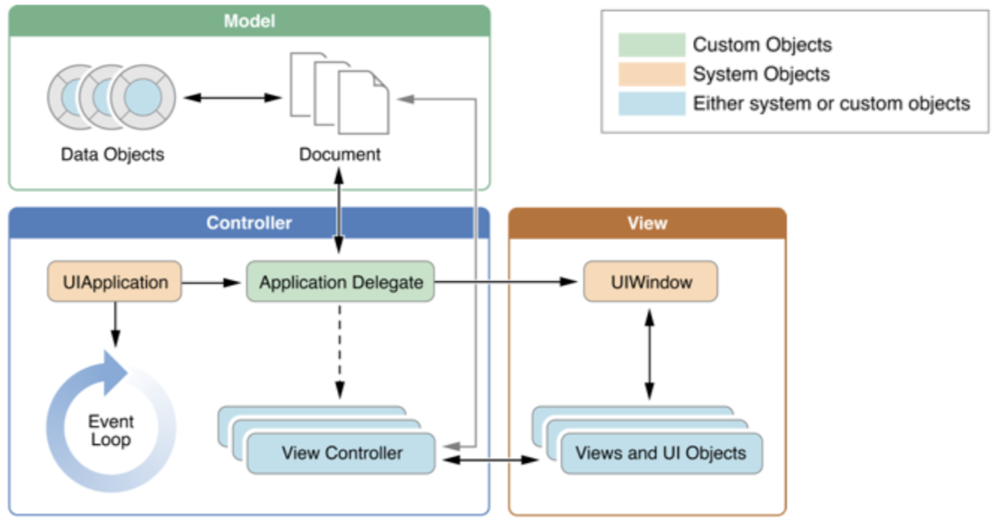
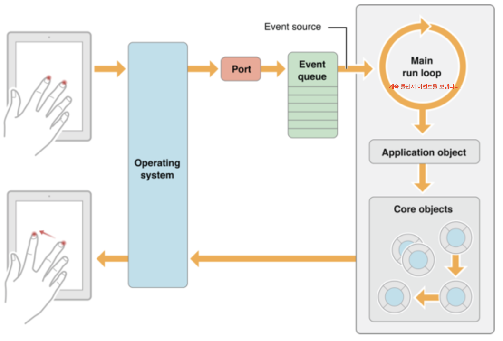
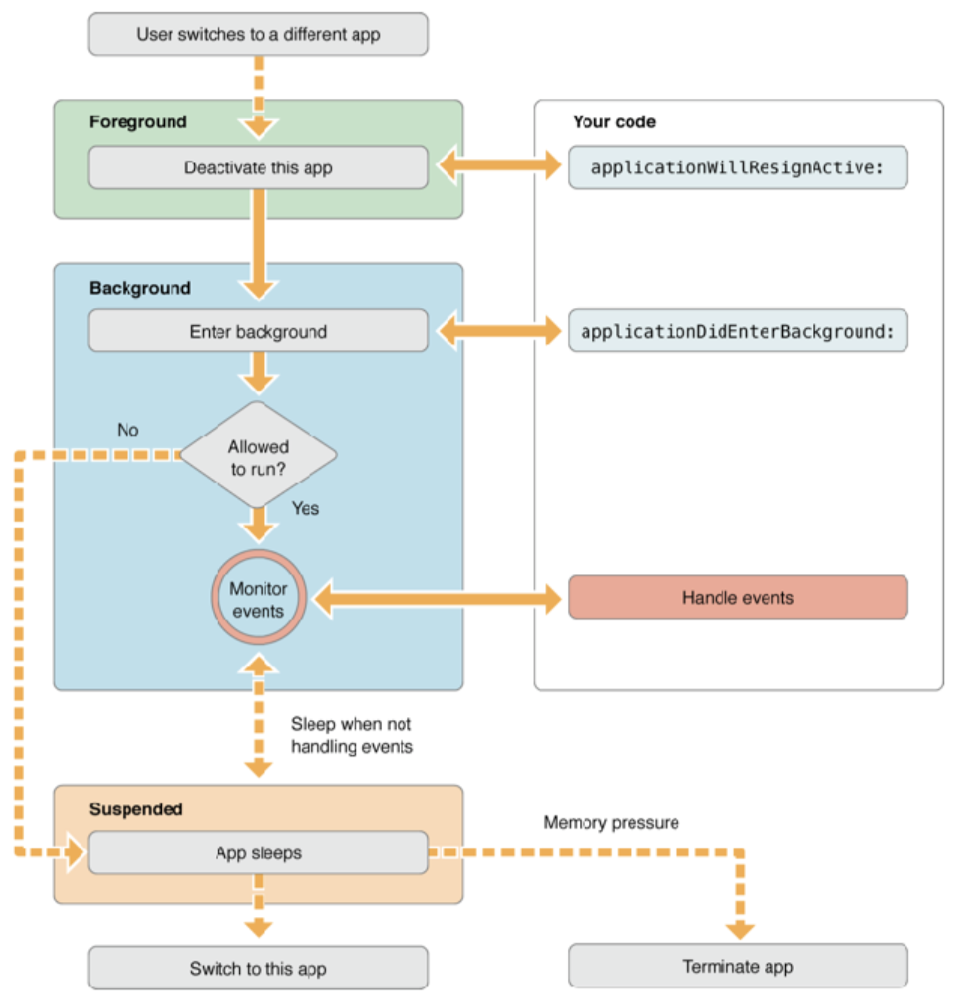

# The App Life Cycle

iOS는 MVC 디자인 패턴을 사용합니다. 자바는 Model과 View도 서로 간섭을 할수 있지만 iOS에서는 Application Delegate를 통해서만 할수 있습니다.




## App State Changes in an iOS app


App는 구동이 시작되면 기본적으로 위와 같은 상태를 돌아가면서(상황에 맞게) 실행하게 됩니다.

기본적으로는 실행되지 않거나 종료되어 있는 상태는 Not running 상태에 있다가 Active 상태로 가게 됩니다.

Active 상태에서 상황에 따라(일정 얼럿이 화면을 덮어서 앱을 사용못하는 상태) Inactive로 가거나 (화면을 꺼도 음악을 실행하거나, 걸어온 길을 트래킹하는등의 동작) Background상태에 들어가기도 합니다.

또 Suspended 상태가 있는데, 백그라운드 상태에서 활동을 멈춘 상태로써 빠른 재실행을 위해서 메모리에 적재된 상태로 있는 상태를 말합니다. 너무 많은 App이 Suspended상태에 있거나 실행되고 있어서 메모리가 부족할 경우 시스템이 강제로 종료하기도 합니다. (어플을 대기화면에 두었다가 다시 들어 갔는데 처음부터 실행되는 상태는 시스템이 강제로 종료했기 때문입니다.)


<br>

## Main Run Loop



대략적으로 위와같인 Run Loop를 가지고 있습니다.

Event queue는 선입선출(FIFO)으로 먼저 들어온 Event가 먼저 나갑니다.


<br>

### Lunch Time

사용자가 App icon을 tap 하면 어플이 실행되면서 아래와 같은 절차가 시작됩니다.

여기거 하는 절차는 물론 개발자가 컨트롤 할수 있지만 어느정도 프로젝트를 만들때 사용하기 쉽게 class로 구현이 되어 있습니다.


그게 AppDelegate입니다.

<br>

## AppDelegate - 난 이 타이밍이 이걸 하겠어!

```swift
import UIKit

@UIApplicationMain
class AppDelegate: UIResponder, UIApplicationDelegate {

    var window: UIWindow?

    func application(_ application: UIApplication, didFinishLaunchingWithOptions launchOptions: [UIApplicationLaunchOptionsKey: Any]?) -> Bool { return true }
    func applicationWillResignActive(_ application: UIApplication) { }
    func applicationDidEnterBackground(_ application: UIApplication) { }
    func applicationWillEnterForeground(_ application: UIApplication) { }
    func applicationDidBecomeActive(_ application: UIApplication) { }
    func applicationWillTerminate(_ application: UIApplication) { }
}
```

AppDelegate는 UIApplicationMain이 하는일을 class에서 위임받아 사용할 수 있게 만들어 놓은 파일입니다.

세부적으로 보면


### @UIApplicationMain

UIApplicationMain은 Objective-C의 프로젝트에 있는 main.m을 대체합니다.

Main.m 파일은 모든 C 프로그램의 시작점인 주 기능을 구현하고 UIApplicationMain을 호출하여 cocoatouch 실행 및 GUI를 작동하기 위한 런루프 및 앱 인프라를 시작합니다.

그 이후에 앱내에서 일어나는 모든 일들은 UIApplicationMain이 AppDelegate에게 위임해서 관리하게 됩니다.

즉 여기서는 App이 최초 실행될때부터 종료가 되기 직전까지를 위임받아서 관리하는 곳입니다. 

우선 @UIApplicationMain를 입력해준뒤 Class를 만들어서 UIResponder, UIApplicationDelegate를 Type으로 받아옵니다.

@UIApplicationMain은 컴파일러에게 여기에 UIApplicationMain 있다고 알려주는 겁니다.

UIResponder, UIApplicationDelegate를 Type으로 받아오면 많은 기능을 사용할수 있지만 대표적으로 다음과 같은 method를 실행할 수 있습니다.

```swift
application:willFinishLaunchingWithOptions:
//App이 최초 실행될 때 호출되는 메소드
application:didFinishLaunchingWithOptions:
//App이 실행된 직후 사용자의 화면에 보여지기 직전에 호출
func applicationDidBecomeActive(_ application: UIApplication) { }
//App이 Acitve 상태로 전환된 직후 호출
func applicationWillResignActive(_ application: UIApplication) {  }
//App이 Inactive 상태로 전환되기 직전 호출
func applicationDidEnterBackground(_ application: UIApplication) {  }
//App이 Background 상태로 전환된 후 호출
func applicationWillEnterForeground(_ application: UIApplication) { }
//App이 Active 상태가 되기 직전에, 화면에 보여지기 직전의 시점에 호출
func applicationWillTerminate(_ application: UIApplication) { }
//App이 종료되기 직전에 호출
```

이렇게 보면 확인하기가 어렵기 때문에 프로젝트에서 직접 만들어 보면 확인을 해 봤습니다.


###Into the foreground  - App이 Active 상태로 전화된 직후


App이 최초 실행되고 처음 초기화를 시작하면 다음과 같은 메소드가 시작이되고,

```swift
application:willFinishLaunchingWithOptions:
```

최종 초기화가 완료 되면 다음과 같은 메소드가 시작되면서

```
application:didFinishLaunchingWithOptions: 
```

App의 상태가 Activate가 됩니다. App이 Acivate 상태로 전환된 직후 DidBecomeActive method가 실행됩니다.

```swift
func applicationDidBecomeActive(_ application: UIApplication) { }
```

applicationDidBecomeActive는 응용프로그램이 비활성 상태일 때 일시 중지되었거나 아직 시작되지 않은 작업을 다시 시작하고, App이전에 Background에 있었던 사용자 인터페이스를 선택적으로 새로 고칠수 있습니다.

>  Restart any tasks that were paused (or not yet started) while the application was inactive. If the application was previously in the background, optionally refresh the user interface.

그뒤로 Event Loop가 돌면서 이벤트를 받아오기도 처리하기도 하면서 App이 실행됩니다.


<br>

### Handling alert-based interruptions - status bar를 내릴경우


사용자가 App을 사용하고 있다가(Event Loop) status bar를 내리거나, 전화가 오거나, 알람이 울리면

applicationWillResignActive method가 실행이 됩니다.

즉 Inactive 상태가 전환되기 직전에 호출이 되는 method입니다.

 applicationWillResignActive는 App이 활성 상태에서 비활성 상태로 이동하려고 할 때 전송이 됩니다. 특정 유형의 일시적 중단이나 사용자가 응용 프로그램을 종료하고 Background 상태로 전환을 시작할 때 발생할 수 있습니다. 진행 중인 작업을 일시 중지하고, 타이머를 비활성화하고, 그래픽 랜더링 콜백을 무효화 하려면 이 방법을 사용합니다. 특히 게임을 일시 중지하려면 이 method를 사용하면 됩니다.

> Sent when the application is about to move from active to inactive state. This can occur for certain types of temporary interruptions (such as an incoming phone call or SMS message) or when the user quits the application and it begins the transition to the background state.
>
> Use this method to pause ongoing tasks, disable timers, and invalidate graphics rendering callbacks. Games should use this method to pause the game.

```swift
func applicationWillResignActive(_ application: UIApplication) { }
func applicationDidBecomeActive(_ application: UIApplication) { }
func applicationWillResignActive(_ application: UIApplication) { }
```

applicationWillResignActive 가 실행되고 난 뒤에 동작을 해야 하면 applicationDidBecomeActive 가 실행되서 Envet Loop가 실행되고 아니면 사용자가 원하는 동작을 실행하게 됩니다.


<br>

### stauts bar를 다시 올리면

```swift
func applicationDidBecomeActive(_ application: UIApplication) { }
```

내렸던 status bar를 다시 올리면 applicationDidBecomeActive가 실행되면서 Event Loop가 실행됩니다.


<br>

### Into the background - Home 버튼을 눌러서 어플밖으로 나가면


홈버튼을 tab해서 App 밖으로 나가게 되면 background로 들어가는 절차가 시작 됩니다.

```swift
func applicationWillResignActive(_ application: UIApplication) { }
func applicationDidEnterBackground(_ application: UIApplication) { }
```

App이 Active에서 Inactive로 갈때 실행되는 applicationwillResignActive가 실행이 되고,

Background로 넘어가면서 applicationDidEnterBackground가 실행이 됩니다.

applicationDidEnterBackground는 공유 리소스를 해제하고, 사용자 데이터를 저장하고, 타이머를 무효화하고, 응용 프로그램을 나중에 종료할 경우 프로그램을 현재 상태로 복원할수 있으며, 응용 프로그램에서 백그라운드 실행을 지원하는 경우 사용자가 종료할 때 응용 프로그램/파일/관리자 대신 이 method를 호출합니다.

> Use this method to release shared resources, save user data, invalidate timers, and store enough application state information to restore your application to its current state in case it is terminated later.
>
> If your application supports background execution, this method is called instead of applicationWillTerminate: when the user quits.

background 상태에서 다시 App을 실행 할수 있으면 monitor Events 상태로 event를 기다리는 상태가 되고 그렇지 않으면 Suspended 상태로 들어가게 됩니다.

Suspended 상태는 메모리가 부족하면 OS에서 어플을 종료 할 수도 있는 상태입니다.


<br>

### 다시 어플로 돌아가면


다른일을 마치고 다시 App으로 돌아가면 Background에 있는 App을 깨우면서 applicationWillEnterForeground:를 실행시킵니다. applicationWillEnterForeground는 Background에서 Active 상태로 전환될때 호출이되며, 여기서 background로 들어갈때 수행한 많은 변경사항을 취소 할수 있습니다.

> Called as part of the transition from the background to the active state; here you can undo many of the changes made on entering the background.

Active상태가 되면 applicationDidBecomeActive method가 호출되면서 다시 Event Loop가 됩니다.

```swift
func applicationWillEnterForeground(_ application: UIApplication) { }
func applicationDidBecomeActive(_ application: UIApplication) { }
```


<br>

### 홈버튼 더블 클릭

아이폰 8에서 홈버튼을 더블 클릭하면 active에서 inactive 상태로 넘어갈때 호출되는 applicationwillResignActive가 호출됩니다.

```swift
func applicationWillResignActive(_ application: UIApplication) { }
```


<br>

###다시 돌아가면

다시 App으로 돌아가면 Active가 될때 호출되는 applicationDidBecomeActive가 호출됩니다.

```swift
func applicationDidBecomeActive(_ application: UIApplication) { }
```


<br>

### 홈버튼 더블 클릭 후 완전 종료



App을 완전 종료하게 되면, Inactive 상태로 전환되면서 applicationWillResignActive method가 활성화 되면서 Background로 들어갈때 활성화 되는 applicationDidEnterBackground가 활성화 됩니다. 이때 App은 실행해야될 부분이 있으면 Monitor enents와 suspended상태에 있게 됩니다.

그리고 App을 완전 종료시키면 applicationWillEnterForeground method가 호출되면서 Memory에서 사라지면서 종료가됩니다.

applicationWillEnterForeground는 필요한 경우 데이터를 저장하면서 App을 종료시킬수 있습니다.

> Called when the application is about to terminate.  Save data if appropriate. 
>
> See also applicationDidEnterBackground

```swift
func applicationWillResignActive(_ application: UIApplication) { }
func applicationDidEnterBackground(_ application: UIApplication) { }
func applicationWillEnterForeground(_ application: UIApplication) { }
```

