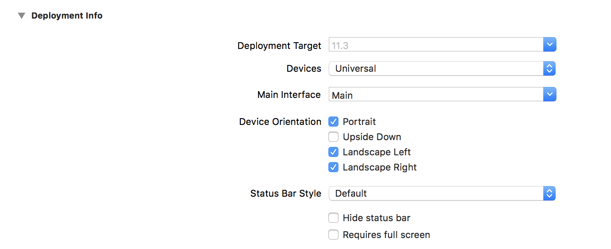

# Main Interface

Project를 만들고나서 Main Interface의 기본값은 Main으로 되어 있습니다.



그런데 처음 시작하는 Main을 임의로 변경해서 사용하고 싶을때 하는 방법입니다.

Main Interface에 있는 Main값을 지운뒤에 시뮬레이터를 돌리면 App이 실행되면서 검은색 확면이 나옵니다.

(Main으로 연결하고 돌려보면 흰색 화면이 나옵니다.)


그건 window가 설정이 안되있기 때문입니다.

window를 설정하려면 AppDelegate.swift 파일로 이동해서 아래와 같은 코드를 입력하면 됩니다.

```swift
@UIApplicationMain
class AppDelegate: UIResponder, UIApplicationDelegate {

    var window: UIWindow?
    
    func application(_ application: UIApplication, didFinishLaunchingWithOptions launchOptions: [UIApplicationLaunchOptionsKey: Any]?) -> Bool {

        
    let window = UIWindow(frame: UIScreen.main.bounds)	//전체 화면을 잡아줍니다.
    window.rootViewController = ViewController()		//viewController()를 인스턴스화 합니다.
    window.backgroundColor = UIColor.white		// 배경색 white
    window.makeKeyAndVisible()		// Main Window로 지정합니다.
    self.window = window			// method 내에서 사용한 window의 값을 class에 있는 window에 넣어줍니다.
        
//만약 self.window에 넣기 싫으면 아래와 같이입력해도 됩니다. 위와 같은 결과를 나오게 합니다.
//        window = UIWindow(frame: UIScreen.main.bounds)
//        window?.rootViewController = ViewController()
//        window?.backgroundColor = UIColor.white
//        window?.makeKeyAndVisible()
        return true
    }
}
```


아래와 같이 입력하고 시뮬레이터를 돌리면 배경색이 흰색으로 변경되었습니다.


사실 거의 Main을 쓰기 때문에 쓸일이 거의 없을거라 생각되지만, 혹시 나중에 찾을수도 있을까 싶어서 간단하게 정리해봤습니다.