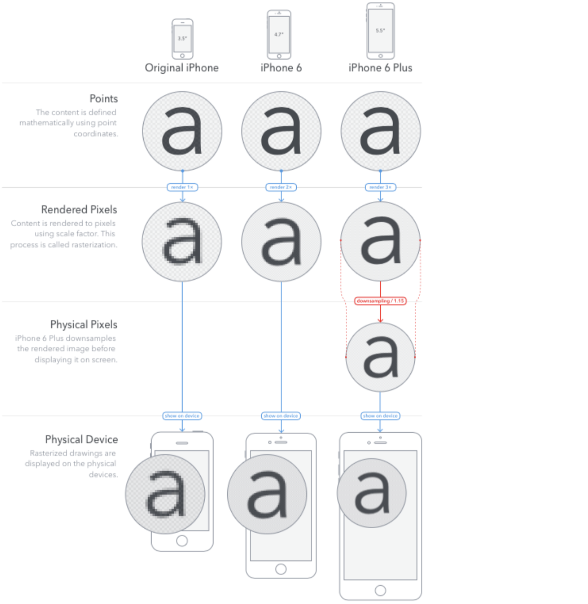
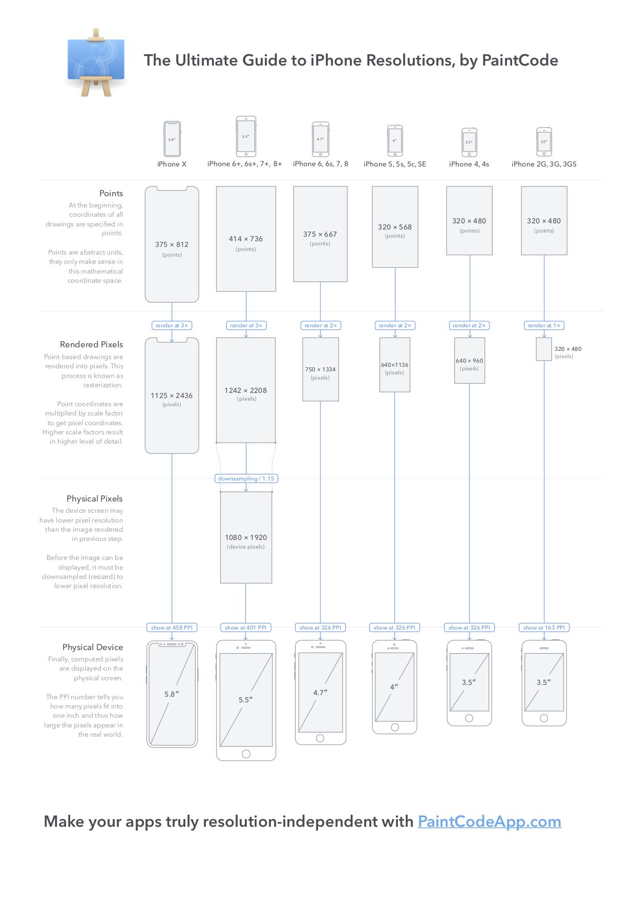

# UI Guide

## What can I konw?

- Display Specifications for iOS Device

- Points?

- iPhone Resolution

  

 

 

## Display Specifivations for iOS Device

[출처 : Apple developer](https://developer.apple.com/library/content/documentation/DeviceInformation/Reference/iOSDeviceCompatibility/Displays/Displays.html)

iOS의 Device에 Display의 물리적인 치수와 UIKit의 논리적 좌표계에 매핑되는 비율의 summary입니다..

- Native Resolution (Pixels) - 기본적인 해상도(iOS Device의 물리적 크기와 pixels)
- UIKit Size - render가 진행되기 전 제작 단계에서의 해상도 (개발)
- Native Scale factor - UIKit Size to Native resolution로 render 될때 비율
- UIKit Scale factor - plus 모델들이 render될때 비율

Device마다 Display의 size 및 Resolution가 차이가 크기 때문에 App제작이 번거로울수 있습니다. 그래서 나온 방식이 points방식 입니다.

 

 

## Points

기존 pixels로 크기가 다른 화면들을 대응하려고 하면, 해상도 및 화면에 맞게 앱을 여러개 제작하거나 이상하게 보이는 상태로 써야 합니다. 그래서 Apple에서는 points를 사용해서 App을 제작하고 실제 화면에는 Line rendering를 해서 보여주는 방식을 사용하고 있습니다.

.png)

[출처 : paintcodeapp - Pixel로만 만들면 생기는 문제](https://www.paintcodeapp.com/news)

그렇게 Point로 제작된 a라는 글자가 화면에 표시될때까지의 절차입니다.

[출처 : paintcodeapp](https://www.paintcodeapp.com/news)

a를 만들면 Rendered Pixels를 거쳐서 Pixel로 만들어 준뒤 실제 화면에 보여줍니다.

(중간에 physical Pixels 단계는 plus 모델들의 단계입니다.)

위와 같은 방법을 쓰면 여러 해상도에서 같거나 비슷한 화면을 보여 줄수 있습니다.

 

 

## iPhone Resolutions

다음은 iPhone Resolutions입니다. 전기종이 Points -> Rendered Pixels -> Physical Device의 절차로 Render를 해서 화면을 보여주고 있습니다.

