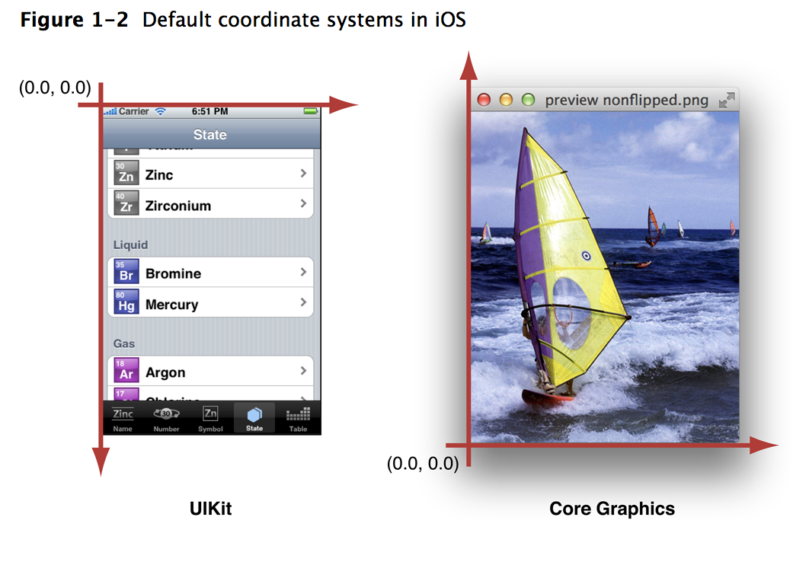
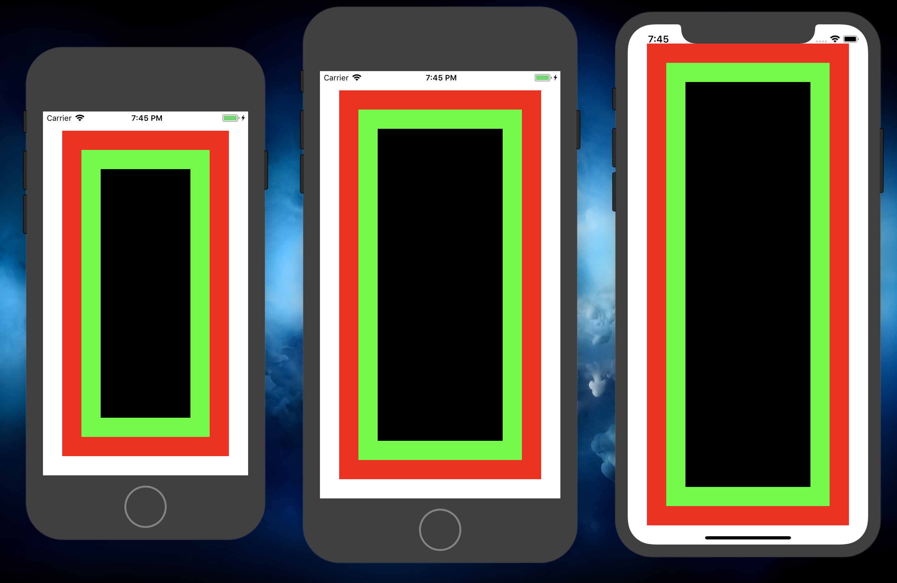
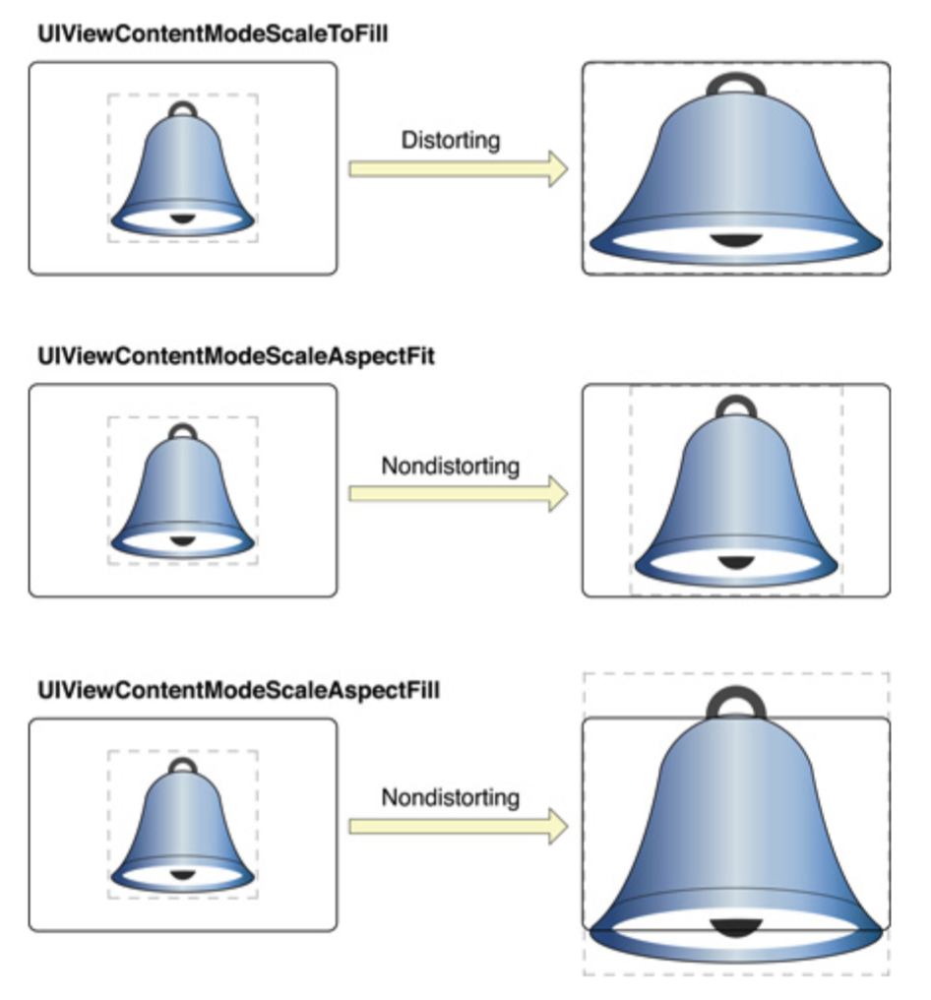
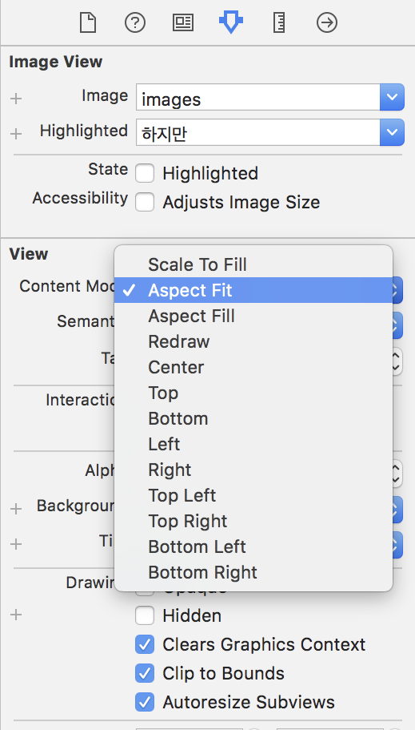

# Frame

## What can I konw?

- Coordinate System orientation
- View Frame
- Frame and Bounds
- Img Scaling
- Img Positioning


<br>

<br>

## Corrdinate System orientation

UIKit에서의 0점 좌표와 Core Graphics Framework의 원점입니다.

UIKit에서는 status bar까지 포함되어 있으며, 화면의 좌측 상단(ULO-based)입니다.



[출처: Apple developer](https://developer.apple.com/library/content/documentation/2DDrawing/Conceptual/DrawingPrintingiOS/GraphicsDrawingOverview/GraphicsDrawingOverview.html)


<br>

<br>

## View Frame

View Frame의 좌표는 상위뷰를 기준으로 결정됩니다.


baseView는 ViewController의 mainView의 원점 좌표를 만들어서 출력해 봤습니다.

subView는 상위뷰를 mainView로 설정(addSubview)한 다음 X, Y 방향으로 +30씩 해서 만들어줬습니다.

greenView도 상위뷰를 mainView로 설정(addSubview)한 다음 X, Y 방향으로 +60씩 해서 만들어줬습니다.


## Frame and Bounds

Frame은 Status  bar까지 포함된 Display의 자체의 원점을 말합니다.

Bounds는 자기자신을 원점으로 사용합니다.

<br>


마지막 boundsView는 X, Y 좌표값으로 greenView의 Bounds의 Min값(가장최소값)을 받아온 뒤에 +30씩 적용해서 만들어 줬습니다.

 greenView의 Bounds의 Min값은 해당 view를 기준으로 X, Y의 0을 쓰기 됩니다.


## Device에 따라 이미지 사이즈가 변합니다.

```swift
import UIKit

class ViewController: UIViewController {
    
    override func viewDidLoad() {
        super.viewDidLoad()
        
        func addView(to frame: CGRect) -> CGRect {
            return CGRect(x: frame.minX + 30, y: frame.minY + 30, width: frame.width - 60, height: frame.height - 60)
        }
        
        func addViewAndColor(with frame: CGRect, color: UIColor) -> UIView {
            let view = UIView(frame: addView(to: frame))
            view.backgroundColor = color
            return view
        }

        let baseView = view.frame
        
        let redView = addViewAndColor(with: baseView, color: .red)
        view.addSubview(redView)

        let greenView = addViewAndColor(with: redView.frame, color: .green)
        view.addSubview(greenView)
        
        let blackView = addViewAndColor(with: greenView.frame, color: .black)
        view.addSubview(blackView)
    }
}
```

<br>

결과 화면 입니다.




<br>

<br>

## Img Scaling

- UIViewContentMedeScallToFill - Img Frame size로 변환(비율 무시)
- UIViewContentModScalleAspectFit - Frame내에서 허용하는 한도로 크게 (비율 유지)
- UIViewContentModeScaleAspectFill - Frame을 벗어나도 비율을 유지하면서 최대한 크게(비율 유지) 



Main.Stroyboard에서 보면

UIViewContentMedeScallToFill는 Scale To Fill과 같습니다.

UIViewContentModScalleAspectFit은 Aspect Fit과 같습니다.

UIViewContentModeScaleAspectFill는 Aspect Fill과 같습니다.




<br>

<br>

## Img Position

옵션에 따른 Img Position입니다.


