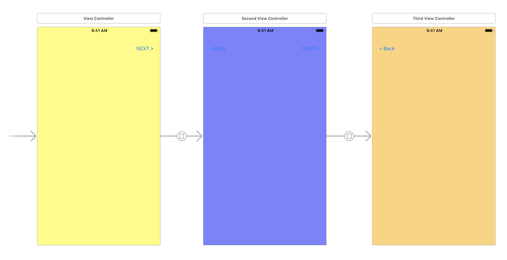

# main.Storyboard를 사용해서 페이지 전환하기

main.Stroyboard에서 view를 설정한 뒤에 @IBAction을 사용해서 페이지를 전환해 봤습니다.



```swift
// View Controller
import UIKit

class ViewController: UIViewController {

    override func viewDidLoad() {
        super.viewDidLoad()
    }

    @IBAction func unWindToViewController(_ sender: UIStoryboardSegue){
        let sourceViewController = sender.source
    }
}
```

```swift
// Second View Controller
import UIKit

class SecondViewController: UIViewController {

    override func viewDidLoad() { super.viewDidLoad() }
    
    // Segue의 소스 뷰 컨트롤러입니다.
    @IBAction private func unWindToSecondView (_ sender: UIStoryboardSegue) {
        let sourceSecondViewController = sender.source
    }
}
```

```swift
// Third View Controller
import UIKit

class ThirdViewController: UIViewController {
    override func viewDidLoad() { super.viewDidLoad() }
    override func didReceiveMemoryWarning() { super.didReceiveMemoryWarning() }
}
```

