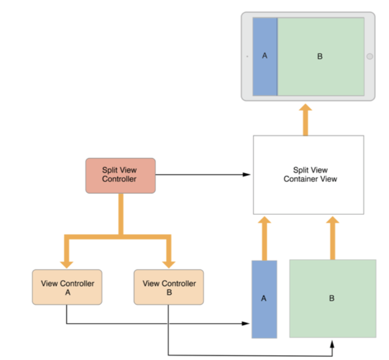
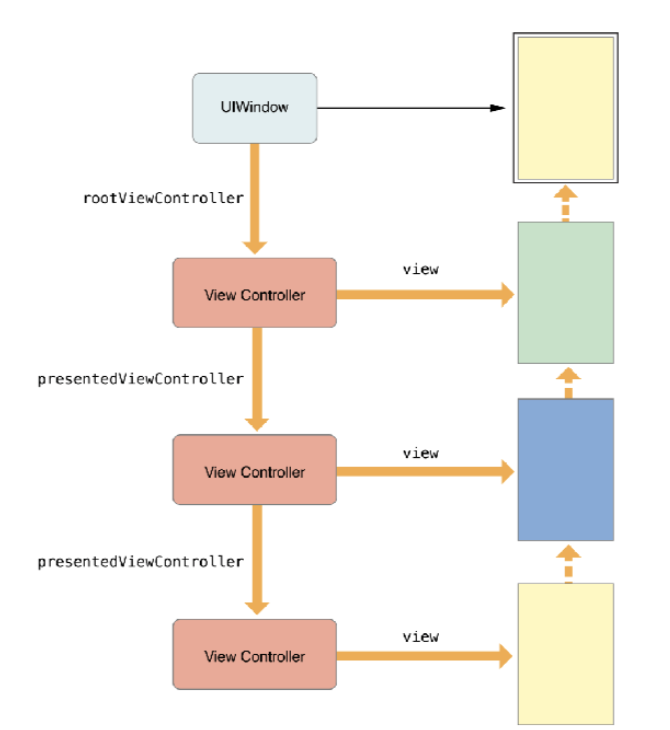
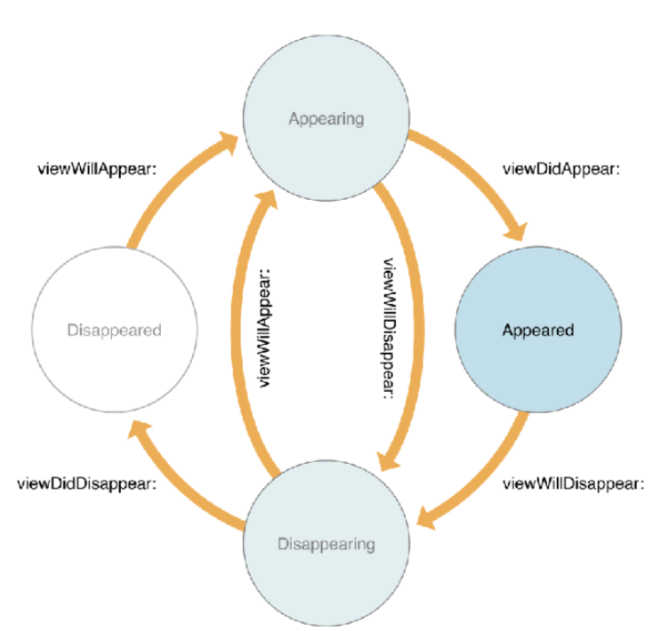

# UIViewController

 

 

 

### UIViewController

- App 구조의 뼈대, 모든 앱에 반드시 하나 이상이며 대부분 많은 수의 ViewController로 구성되어 있습니다.
- 1개가 있을때는 반드시 window의 rootView에 들어가게 되어 있고, 추가 하면 SubView에 들어가게 됩니다.

 

 

### View Management 

- 가장 중요한 역할 - 뷰 계층 관리 
- 모든 뷰컨트롤러마다 RootView를 지니며, 화면에 표시하기 위해서는 해당 RootView 계층에 속해야 함 
- ViewController에는 반드시 1개의 view가 들어가 있습니다.
- Stroyboard에서 ViewController을 올리면 view가 하나씩 따라오게되는게 그게 RootView입니다.
- 기본적인 계층 : window > viewcontroller > rootview > view

 

 

### Two types of view controllers 

#### Content View Controllers 

-  모든 뷰를 단독으로 관리
 
- UIViewController, UITableViewController, UICollectionViewController 등이 여기 속합니다.

 

#### Data Marshaling

- MVC (Model - View - Controller)
- 자신이 관리하는 View 와 Data 간 중개 역할 (직렬화)

 

 

#### Containter View Controllers
 

- 자체 뷰 + 하나 이상의 자식 뷰 컨트롤러가 가진 루트뷰 관리
  
- 컨테이너는 컨텐츠를 관리하는 것이 아니라 루트뷰만 관리하며 컨테이너 디자인에 따라 크기 조정

- UINavigationController, UITabbarController, UIPageViewController 등이 여기 속합니다. 

ViewController을 여러개 가지고 있는 RootView를 관리하여서 컨테이너의 디자인에 따라 크기를 조정하게 됩니다.

 

 

### 이벤트 처리 (User Interactions)

- 뷰컨트롤러는 Responder 객체 : 직접 이벤트를 받아 처리 가능하나 일반적으로 지양 
- 뷰가 그 자신의 터치 이벤트를 연관된 객체(보통 뷰컨트롤러)에 action 메서드나 delegate 로 전달 

 

 

### 뷰컨트롤러가하는 일 (Resource Management )

- 뷰컨트롤러가 생성한 모든 뷰와 객체들은 뷰컨트롤러의 책임이 있습니다,
- 뷰를 생성하거나, 소멸시키거나, 잡고 있다가 놔주는 방식등이 있습니다.
- 뷰컨트롤러의 LifeCycle 에 따라 생성되었다가 자동 소멸되기도 하지만 ARC 개념에 맞게 관리가 필요합니다.
- 메모리 부족 시 didReceiveMemoryWarning 메서드에서 캐시 메모리 등 꼭 유지하지 않아도 되는 메 모리들은 정리가필요합니다.

예를들어 메모리 부족 워닝이 발생하면 시스템이 뷰컨트롤러에게 메모리가 부족하다고 알림을 보내게 됩니다.

그 알람을 받은 뷰컨트롤러는 지금 당장 필요하지 않은 이미지와 같은 걸 제거해주거나 나중에 다시 열때 사용하도록 구현할수 있습니다.

 

 

### Adaptivity

- 뷰컨트롤러는 뷰의 표현을 책임지고, 현재 환경에 적절한 방법으로 적용되도록 할 책임을 가짐 
- iOS9 부터 Regular, Compact라는 개념이 생겼습니다.
- 이는 길이에 따른 비율의 개념입니다.
- 뷰컨트롤러는 뷰의 표현을 책임지고 환경에 적절한 방법으로 적용되게 해야 합니다.
- 비율의 개념은 사용하거나 수치를 사용 오토레이아웃을 잡아서 환경에 적절한 방법으로 적용되게도 합니다. 

 

 

## 뷰컨트롤러의 구조 - The View Controller Hierarchy

 

### The Root View Controller 

- Content View Controller입니다.
- UIWindow 자체로는 유저에게 보여지는 컨텐츠를 가지지 못합니다.  (기본 바탕화면이 없음을 뜻합니다.)
- Window는 정확히 하나의 Root View Controller 를 가지는데 이것을 통해 컨텐츠를 표현합니다.
- UIWindows도 UIView의 Subclass입니다.
- ViewController에 있는 rootView가 가지고 있는 컨텐츠를 표현합니다.

 

 

### Container View Controllers 

- 컨텐츠를 직접 관리하는게 아닌 루트뷰만 관리해서 컨테이너의 디자인에 따라 크기를 조정 할수 있게 됩니다.
- Split View Controller는 ViewController 2개가 존재하고 그걸 컨트롤하는 rootViewController가 있습니다.
- Split View Container View는 직접적으로 ViewController를 조정하지 않고도 rootViewController만 조정해서 자신의 디자인에 맞게 ViewController들의 크기를 조정하게 됩니다.

 

 

### Presented View Controllers 

- UIWindow 자체로는 유저에게 보여지는 컨텐츠를 가지지 못합니다.  (기본 바탕화면이 없음을 뜻합니다.)
- Window는 정확히 하나의 Root View Controller 를 가지는데 이것을 통해 컨텐츠를 표현합니다.
- 그렇게 표현된 ViewController은 persentedViewController을 다음뷰 그 다음뷰를 표현하게 됩니다.
- 이와 같은 구조는 다시 첫 화면으로 돌아올때 하나씩 뷰컨트롤러에서 빠져나오면서 이전뷰로 돌아가야 합니다.

 

 

### A container & a presented View Controller 

- Container와 presented를 같이 사용하는 구조 입니다.
- UIWindow 자체로는 유저에게 보여지는 컨텐츠를 가지지 못합니다.  (기본 바탕화면이 없음을 뜻합니다.)
- Window는 정확히 하나의 Root View Controller 를 가지는데 이것을 통해 컨텐츠를 표현합니다.
- 네비게이션 컨트롤러에 ViewController을 childViewController을 사용해서 Stack처럼 쌓아서 가지고 있습니다.
- 여기서 해당 화면은 presented하면 보여지게 되고, 만약 presented가 없다면 가장 마지막에 쌓인 ViewController가 화면에 보기게 됩니다.

 

 

## View Controller Life Cycle 

 

 

### 실제로 해보면

- 조건 : 스토리 보드에서 ViewController를 3개를 만들어서 NEXT를 누르면 다음 화면으로 넘어가게 했습니다.

 

- 처음 App이 구동되면서 첫 화면이 나오면서 

  > 1. viewDidLoad 
  >    - ViewController가 memory에 로드 된 후 호출합니다.
  > 2. viewWillAppear 
  >    - View가 View Hierarchy(계층)에 추가될 예정임을 ViewController에게 알립니다.
  >    - 즉, View가 새롭게 호출된다는 것을 ViewController에게 알립니다.
  > 3. viewDidAppear
  >    - View가 View hierarchy(계층)에 추가 되었음을 ViewController에 알립니다.

 

- 다음 화면을 불러오면

  > 1. viewDidLoad
  >    - ViewController가 memory에 로드 된 후 호출합니다. 
  > 2. viewWillDisappear
  >    - View가 View hierarchy에서 삭제되려고 한다는걸 ViewController에 알립니다.
  > 3. viewWillAppear
  >    - View가 새롭게 호출된다는 것을 ViewControeller에게 알립니다.
  > 4. viewDidAppear
  >    - View가 View hierarchy(계층)에 추가되었음을 ViewController에 알립니다.
  > 5. viewDidDisappear
  >    - View가 View hierarchy(계층)에서 삭제 된 것을 ViewController에 알립니다.

  

- 세번째 화면을 불러오면 다음 화면을 불러오는 과정과 같은 과정을 반복합니다.

  > 1. viewDidLoad
  > 2. viewWillDisapper
  > 3. viewWillAppear
  > 4. viewDidApper
  > 5. viewDidDisappear

 

 

