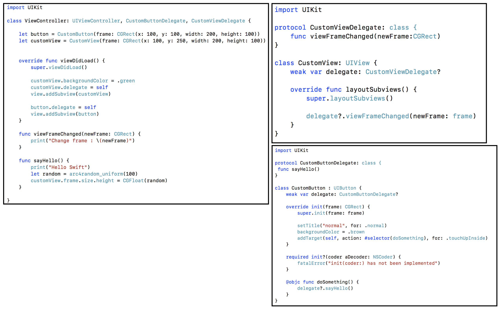

# Delegate

> (권한업무 등을) 위임하다.
>
> Delegate는 디자인 패턴입니다.

- 델리게이트 패턴은 자신이 할 일을 다른 인스턴스에게 대신 처리하도록 구현하는 디자인 패턴으로 객체지향에서 하나의 객체가 모든 일을 처리하는게 아니라 일의 일부를 다른 객체에 넘겨서 처리하도록 하는걸 뜻합니다.
- 요청하는 객체와 요청에 응답할 객체로 나누어 작성
- 주로 다음과 같은 상황에 사용에서 뷰는 보여주는거만 집중합니다.

  - 뷰가 받은 이벤트나 상태를 뷰컨트롤러에게 전달하여 처리하도록 함 (View -> ViewController)
  - 뷰 구성에 필요한 정보를 뷰컨트롤러가 결정하도록 함 (View <- ViewController) 
- 주요 코드는 숨기고 가능한 특정 상황에 대해서만 커스터마이징 할 수 있도록 제공 

<br>

<br>

## Delegate - 예를 들면

- AppDelegate와 소통하는 객체는 UIApplication 입니다. (App cycle을 참고)
- UIApplication은 상황이 생기면 자기가 결정하는게 아니라 AppDelegate에 물어봅니다.
- AppDelegate에 만들어준 동작을 하게 됩니다.
- UIApplication에서 동작하고 있는데 우리는 자세히 몰라도 (주요코드는 숨기고) 상황(백그라운드로 간다던지와 같은)만 받아서 코드를 커스텀마이징해서 사용하고 있습니다.

<br>

<br>

## Delegate 선언

- 선언만 하고 실제로 어떤 기능을 할지는 알수가 없습니다. 

```swift
// class에 한정해서만 사용하도록 Type을 class로 합니다.
protocol CustomViewDelegate: class {
	func viewFrameChanged(newFrame:CGRect)
}

// 위에서 선언한 프로코콜을 타입으로 적어주면 delegate변수에는 CustomViewDelegate를 채택한 class 뷰만 담을수 있습니다. 
class CustomView: UIView {
	weak var delegate: CustomViewDelegate? // 프로토콜 타입

    override func layoutSubviews() {
        delegate?.viewFrameChanged(newFrame: frame)
    }
```

1. protocol을 생성합니다.
2. class에 protocol을 type으로 가지는 delegate property를 생성합니다.
3. Delegate의 instance의 method를 실행합니다.
   - 현재 customView입장에서는 delegate instance의 존재 여부를 알수 없습니다.
   - 하지만 instance(A)가 나의 delegate instance 값을 할당했다면, 분명 A는 나의 protocol을 채택하였으며, 타입이 같기 때문에 method를 구현했다는 것까지 알게 됩니다.
   - Delegate method를 사용해서 method를 실행 및 반환값을 받아와 사용할수 있게 됩니다.


여기서 layoutSubviews는 UIView를 상속받아 override를 하면 사용할수 있는 함수인데, 서브뷰의 사이즈나 position을 변경할수 있습니다.

또 layoutSubviews는 서브뷰들이 위치를 새로 잡을때마다 호출되게 되는데 method 내부에 delegate?.viewFrameChanged(newFrame: frame)를 넣어놨기 때문에 서브뷰의 사이즈나 position이 변경되면 해당 method를 호출하게됩니다.

<br>

<br>

## Delegate 구현부 

- 클래스는 다중 상속이 안되고 , 프로토콜만 다중상속이 가능합니다.

```swift
// CustomViewDelegate 프로토콜을 선택해서 사용하는 class는 무조건 포함된 메서드를 사용해야 합니다.
class ViewController: UIViewController, CustomViewDelegate {
	override func viewDidLoad() {
		super.viewDidLoad()

		let customView = CustomView()
		customView.delegate = self
		view.addSubview(customView)
	}

func viewFrameChanged(newFrame: CGRect) {
	// CustomView 의 프레임이 변경될 때마다 실행할 코드 작성
    print("Change frame : \(newFrame)")
}
```

1. class에 위에서 선언한 CustomViewDelegate 채택
2. 채택한 Delegate method 구현합니다.
   -  `func viewFrameChanged(newFrame: CGRect) { print("Change frame : \(newFrame)")  }` 입니다.
   - customView의 frame이 변경될때마다 실행이 됩니다.
3. 위임자(대리자)를 정해주는 과정을 해야 합니다.
   - 여기서는 `customView.delegate = self` 입니다
   - `customView` 가 해야 할일을 알려주는건 내가 할게 라는 뜻입니다. 여기서 나는 `ViewController` 입니다.
   - 즉 이벤트가 발생하면 `ViewController` 은 프로토콜에 따라 `customView` 에게 알려주겠다 라는 상태입니다.
   - 프레임이 변경될때마다 ViewController은 프로토콜에 따라 customView에게 알려주게 되고 customView는 `override func layoutSubviews() { delegate?.viewFrameChanged(newFrame: frame) }` 를 실행하게 됩니다.

<br>

<br>

## `customView.delegate` 에 self를 할당할수 있는 이유

프로토콜을 클래스와 다르게 다중상속이 가능한데, 여기서는 `ViewController`에 프로토콜인 `CustomViewDelegate`를 상속받았습니다.  

그렇기 때문에 선언부의 `weak var delegate: CustomViewDelegate?` 과 같은 Type인  `protocol CustomViewDelegate`가 되기 때문에 `customView.delegate에 ViewController(self)`를 할당 할수 있습니다.

<br>

<br>

## 예제로 보는 Delegate




- `class CustomButton` 과 `class CustomView` 는 **선언부**, `ViewController` 은 **구현부**입니다.
- `protocol` 은 구현은 하지 않고 최소한으로 가져야할 **속성**이나 **method**를 정의만합니다.
- `protocol` 은 `class` 와 다르게 다중상속이 가능합니다.

<br>

```swift
import UIKit

class ViewController: UIViewController, CustomButtonDelegate, CustomViewDelegate {
    
    let button = CustomButton(frame: CGRect(x: 100, y: 100, width: 200, height: 100))
    let customView = CustomView(frame: CGRect(x: 100, y: 250, width: 200, height: 100))

    override func viewDidLoad() {
        super.viewDidLoad()
        
        customView.backgroundColor = .green
        customView.delegate = self
        view.addSubview(customView)
        
        button.delegate = self
        view.addSubview(button)
    }
    
    func viewFrameChanged(newFrame: CGRect) {
        print("Change frame : \(newFrame)")
    }
    
    func sayHello() {
        print("Hello Swift")
        let random = arc4random_uniform(100)
        customView.frame.size.height = CGFloat(random)
    }
}
```

구현부인 ViewController은 `CustomButtonDelegate` 와 `CustomViewDelegate` 를 채택하였습니다.

프로토콜을 타입으로 받으면 정의된 속성이나 메소드는 특정한 상황이 아니고서는 무조건 사용해야 합니다.

<br>

`CustomButtonDelegate` 를 채택했으니 선언부에서 만든어준 func func sayHello() { }를 사용해야하고

`CustomViewDelegate` 를 채택했으니 선언부에서 만들어준 func viewFrameChanged(newFrame: CGRect) {}를 사용해야합니다.

<br>

그리고 `button` 은 `class CustomButton` 을 할당받았고,` custonView` 는 `CustomView` 를 할당받은 뒤

`customView.delegate = self` , `button.delegate = self` 로 위임자를 지정해줬습니다.

위임자(대리자)로 지정된 ViewController은 이벤트가 발생하면 프로토콜에 따라 customView와 button에게 알려주게 되고 각각 정의된 method를 실행하게 됩니다.

button 과 customView

<br>

동작하는 순서를 보면

1. 화면이 구성되면서 `CustomButtonDelegate` 와 `CustomViewDelegate` 채택됩니다.

2. `override func viewDidLoad() {}` 실행됩니다.

3. 최초 실행인 viewDidLoad()가 끝나고보니 subView로 생성된 `class CustomView`(선언부)의 사이즈가 `frame: CGRect(x: 100, y: 100, width: 200, height: 100)` 로 생성됩니다.

4. `subView` 의 위치를 새로잡거나 변경되면 `override func layoutSubviews() { }`라는 metohd가 실행이 되고,

   - func layoutSubviews()는 서브뷰에 위치를 새로잡으면 실행됩니다.

5. method 내부에 있는 `delegate?.viewFrameChanged(newFrame: frame)` 가 실행되면서 `ViewController` (구현부)의 함수가 실행됩니다. 여기서 `CustomView`의 frame값을 parameter로 구현부로 넘겨주게 되면서 변경된 값이 출력되게 됩니다. 

   ```swift
       func viewFrameChanged(newFrame: CGRect) {
           print("Change frame : \(newFrame)")
       }
   ```

   

6. 그뒤 다시 CustomView(선언부)로 넘어가서 더이상 실행할 명령이 없으면 종료하게 됩니다.

<br>

1. Button을 클릭하면 class CustomButton이 실행되게 되면서, delegate?.sayHello() 가 실행되고 ViewConroller(구현부)의 함수를 동작하게 됩니다. 이 함수는 랜덤으로 100까지 나온 숫자로 customView의 높이값을 변경해주게 됩니다.

   ```swift
       func sayHello() {
           print("Hello Swift")
           let random = arc4random_uniform(100)
           customView.frame.size.height = CGFloat(random)
       }
   ```

2. 함수가 일을끝내가 되면 다시 CustomButton으로 돌아가서 더이상 할일이 없으면 종료를 하게됩니다.

3. 종료가 된뒤 CustomView(선언부)는 subView의 높이값이 변경된것을 알아서 `override func layoutSubviews() { }` method가 실행되게 되고 위쪽의 4번부터 6번까지가 실행되게 됩니다.

<br>

<br>

이와같이 Delegate를 사용해주면 선언해주는 곳과 구현해주는 곳을 나눠서 사용 할수 있습니다. 예를들어 알람창을 계속 사용하는데 매번마다 알람의 내용을 변경해야 한다면, 알람창을 선언해줘서 항상 사용하게 해주고 내용은 구현부에서 넣어서 동작하게 할수 있을겁니다.

<br>

<br>