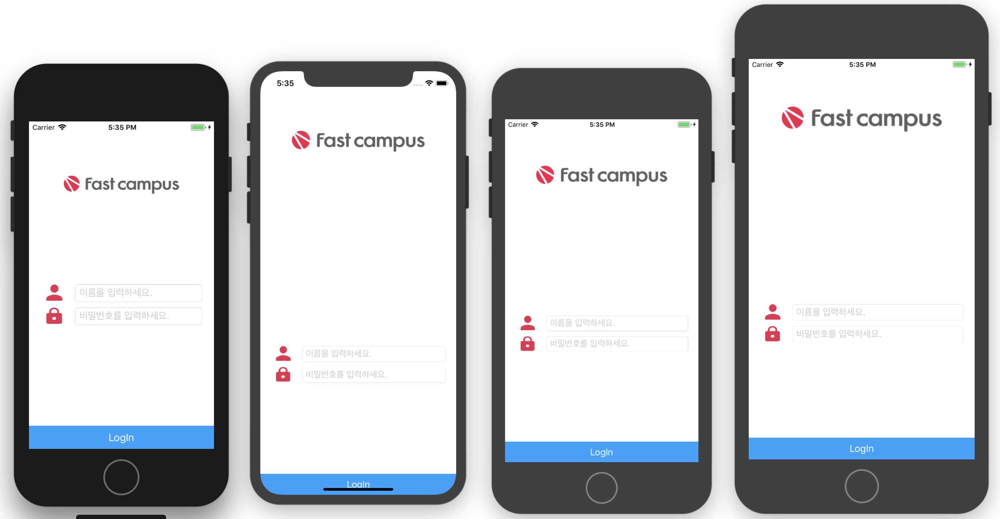
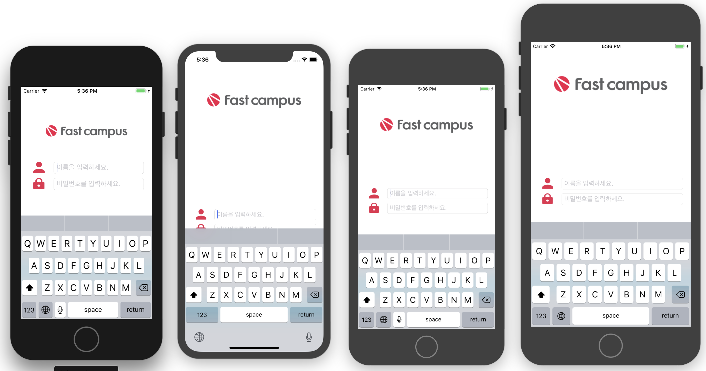

Delegate에 대해서 알아보기

---

Login 화면 구현해보기

- 아무것도 입력하지 않고 로그인을 누르면 정보를 입력하라는 알람 보여주기
- 아이디와 비밀번호를 잘못입력하면 잘못입력했으니 다시 입력하라는 알람 보여주기
- 정상적으로 로그인 하면 다음페이지에서 ID정보를 받아와서 표시해주기 (UserDefault 사용)
- 로그인페이지가 여러종류의 디바이스에서 비슷하게 보이게 만들기 (code로만 구현 - Stroyboard 없이)
- Keyboard가 올라오면 로그인을 입력하는 곳도 같이 올라가게 하기 (Class를 나눠서 구현해 볼것)

---

