# AutoLayout

- View에 주어진 제약조건에 따라 View의 위치를 동적으로 계산해 배치하는 것으로 외부 또는 내부 변화에 동적으로 반응하여 유저 인터페이스를 구성하는것을 말합니다.

<br>

<br>

<br>

## StoryBoard 

### 외적변화요소

- 서로 다른 기기 및 스크린의 크기
- 기기 회전
- iPad / iPhone+ 등에서 Split View로 진입하거나 빠져 나올때

<br>

### 내적변화요소

- 앱에서 보여지는 컨텐츠가 변화하거나
- 국제화 지원 ( 로컬라이징, 날짜와 숫자, RTL 등)
- Dynamic Type 지원하여 사용자가 변경할때 (글꼴의 크기)

<br>

<br>

## Laying out a user interface (유저 인터페이스 구성)

- 유저 인터페이스를 구성하는는 주요 접근 방식입니다.

<br>

### 1. Frame 기반의 프로그래밍 방식

- View의 Frame을 사용해서 프로그래밍을 하는 방식입니다.
- 개발자가 하나하나 설정이 가능하기에 가장 유연하며 빠른 성능을 가집니다.
- 모든 뷰에 대해서 개별적인 설정과 관리를 해야합니다.
- 설계 및 디버그, 유지 관리에 많은 노력이 필요합니다.

```swift
import UIKit

class ViewController: UIViewController {
    
    let redFrame = UIView()
    let blueFrame = UIView()
    
    override func viewDidLoad() {
        super.viewDidLoad()
        subViewDisplay()
    }
    
    func subViewDisplay() {
        let redFrameCGRect = CGRect(x: view.frame.minX + 20 + view.layoutMargins.left, y: view.frame.minY + 20 + view.layoutMargins.top, width: (view.frame.maxX / 2) - 25 - view.layoutMargins.left, height: (view.frame.maxY - 40) - view.layoutMargins.top)
        
        let blueFrameCGRect = CGRect(x: redFrameCGRect.maxX + 10, y: redFrameCGRect.origin.y , width: redFrameCGRect.width, height: redFrameCGRect.height)
        
        redFrame.frame = redFrameCGRect
        blueFrame.frame = blueFrameCGRect
        
        redFrame.backgroundColor = .red
        blueFrame.backgroundColor = .blue
        
        view.addSubview(redFrame)
        view.addSubview(blueFrame)
    }

    override func viewDidLayoutSubviews() {
        subViewDisplay()
    }
}
```

ViewFrame을 기반으로 모든 뷰에 대해 개별적인 설정과 관리를 해야 하기 때문에 디바이스(디스플레이)가 다양해 지면서 일일히 대응하기가 쉽지 않았습니다.

그래서 나온 접근 방법이 Auto Layout 방식입니다.

<br>

<br>

### 2.AutoLayout

- Frame방식이 원점으로부터의 떨어진 거리, 뷰의 너비, 높이를 직접 정해줘서 인터페이스를 구성했다면, AutoLayout방식은 뷰들간의 관계설정(제약 조건)을 정해주면 크기와 위치를 계산해서 유저 인터페이스를 정의하는 방식입니다.
- AutoLayout이라해서 자동으로 잡아주는게 아닙니다.
- 내적 / 외적 변화 요소에 동적으로 반응합니다.
  - 예를들면 모든 디바이스에서 비슷한 화면이 나오도록 구성이 가능합니다.
- Frame 기반에 비해 느린 퍼포먼스를 가집니다.

<br>

### Storyboard에서의 AutoLayout

<br>

#### Constrain Attribute

- Top
- Bottom
- Left or Leading - Left는 절대값이고 Leading는 상대적으로 왼쪽
- Right or Trailing - Right는 절대값이고 Trailing는 상대적으로 오른쪽
- Center X
- Center Y

#### Size Attribute

- Width
- Height

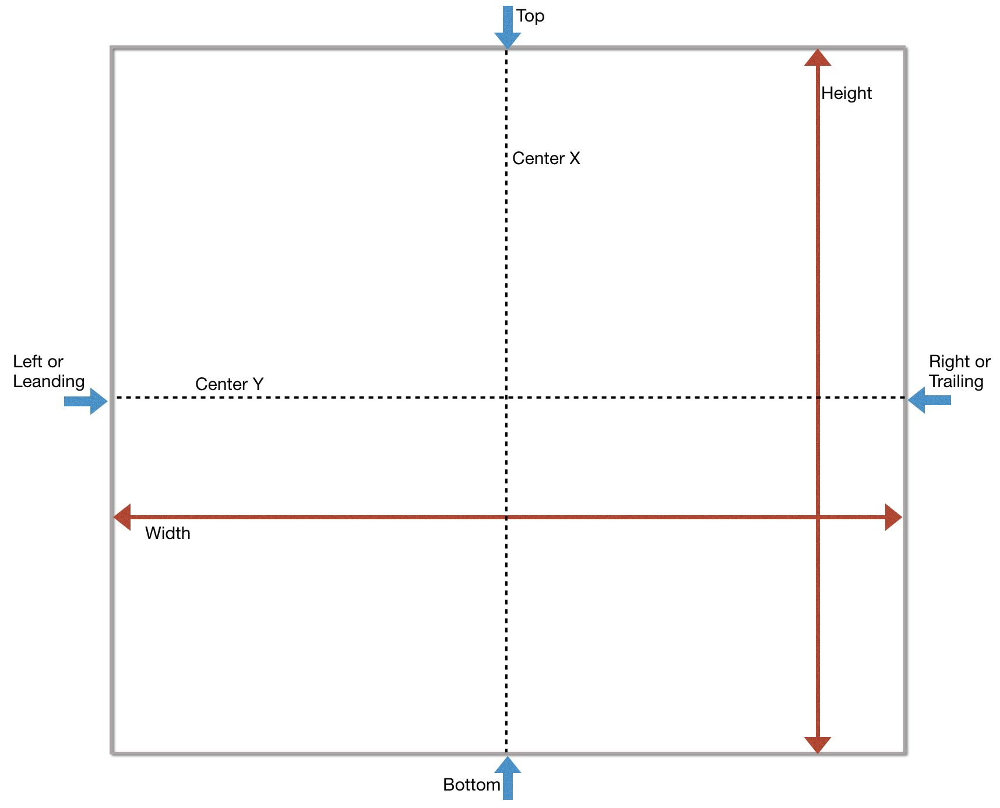

<br>

<br>

### Storyboard Auto Layout tools

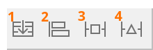

1. Stack : 선택한 객체들을 하나의 stack view로 변환
2. Align : 정렬에 관한 제약사항을 설정
3. Pin : 객체 간 상대적 거리 및 크기에 관한 제약사항 설정
4. Resolve Issues : 오토레이아웃 관련 문제를 해결

<br>

<br>

#### Auto Layout tool - Align

- 정렬에 관한 제약사항을 설정

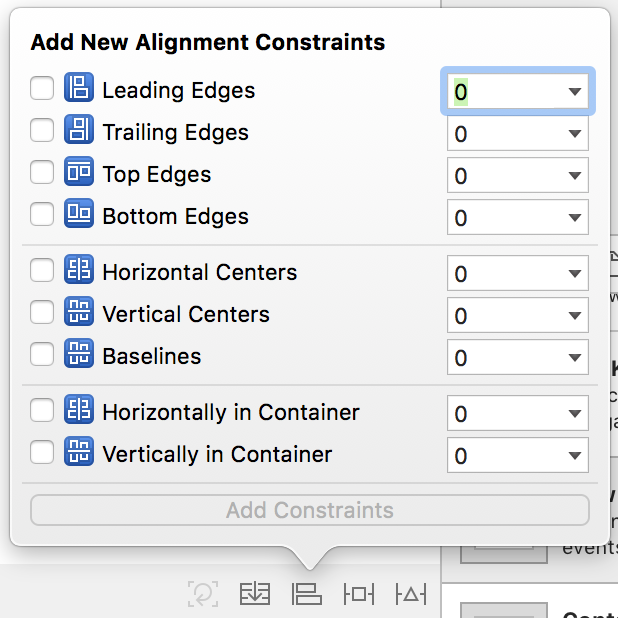

<br>

<br>

#### Pin

- 다른 View(rootView 포함)과의 거리 제약을 줄수 있습니다.
- Constrain to margins를 클릭하면 Margins만큼 값이 빠진채로 제약이 들어갑니다.
  - View는 기본적으로 margins이 잡혀 있습니다. 
  - 랭기쥐 디렉서녈
  - 픽스드는 left right
  - 약간의 간격을 처음부터 설정해 두면 약간의 여백을 가지고 시작할수 있습니다.
- 뷰의 Width, Height로 Size를 정해줄수 있습니다.
- Equal Widths, Equal Heights로 다른 뷰와 같은 사이즈를 정해줄수 있습니다.

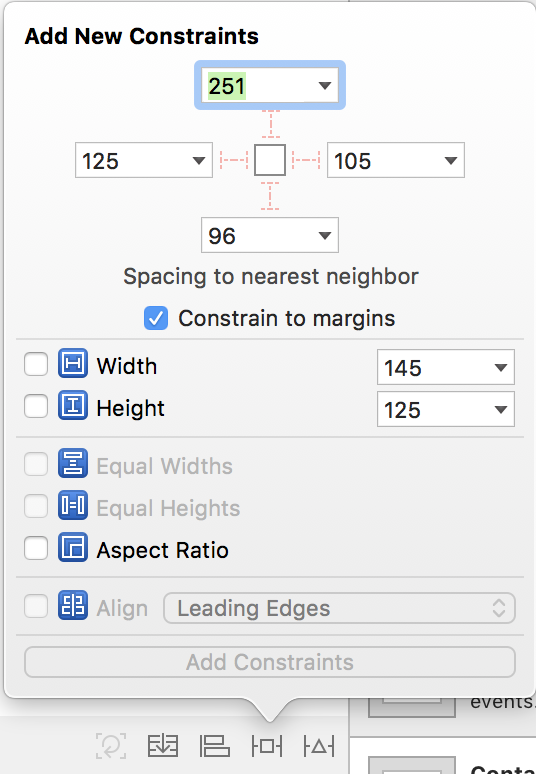

<br>

<br>

#### Resolve Auto Layout Lssues

- 미처 잡지 못한 Constraints를 자동으로 잡아 주기도 하고 Constraints를 초기화도 할수 있습니다. 오토레이아웃 관련 문제가 발생하면 해결할수 있는 도구입니다.

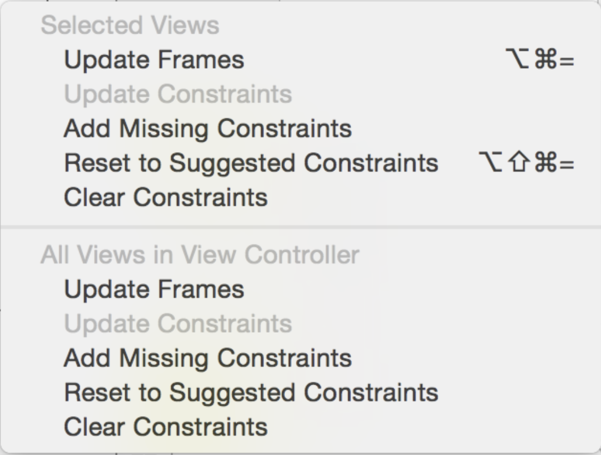

<br>

<br>

###  Stroyboard Constraint

- 제약 조건입니다.
- 걸어준 제약 조건을 변경할수도 있습니다.
- 걸어준 제약조건이 있다면 Inspecter의 Constraints에서 제약 조건 별로 Edit가 가능합니다.
- 제약조건이 계산되는 공식은 다음과 같습니다.
  - Item1.Attribute = (Multiplier * Item2.Attribute) + Constrant
  - 아래 사진에서 보면 View.Top = 1 * Safe Area.Top + 215이 됩니다.
  - Constrant는 두개의 item 사이의 거리입니다.
  - Multiplier는 Item2.Attribute의 배율입니다.
  - Placeholder를 체크한다면 Storyboard 상에서는 적용되어 보이지만 Runtime시에는 적용이 되지 않다가, 인스턴스로 IBOutlet에 연결해준뒤 Remove at Build time을 풀어주면 적용이 되는 식으로 사용이 가능할것 같습니다. 즉, 화면밖에 있다가 안으로 들어오는걸 구현할때 최종위치를 잡아 준뒤에 Remove at bulid time을 해두고 그걸 다시 풀어주면 화면밖에 있다가 안으로 들어오게됩니다.

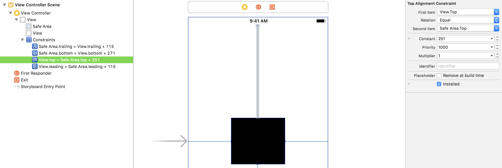

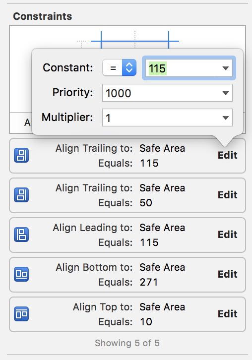

<br>

<br>

#### Nonambiguous, Satisfiable Layouts 

- AutoLayout은 상대적인 개념으로 사용되기 때문에 정확한 위치를 계산할수 있도록 해줘야 합니다.
- 그러나 정확한 위치를 계산하게 하더라도 제약을 어떤식으로 사용하냐에 따라서 결과가 달라 질수 있습니다.

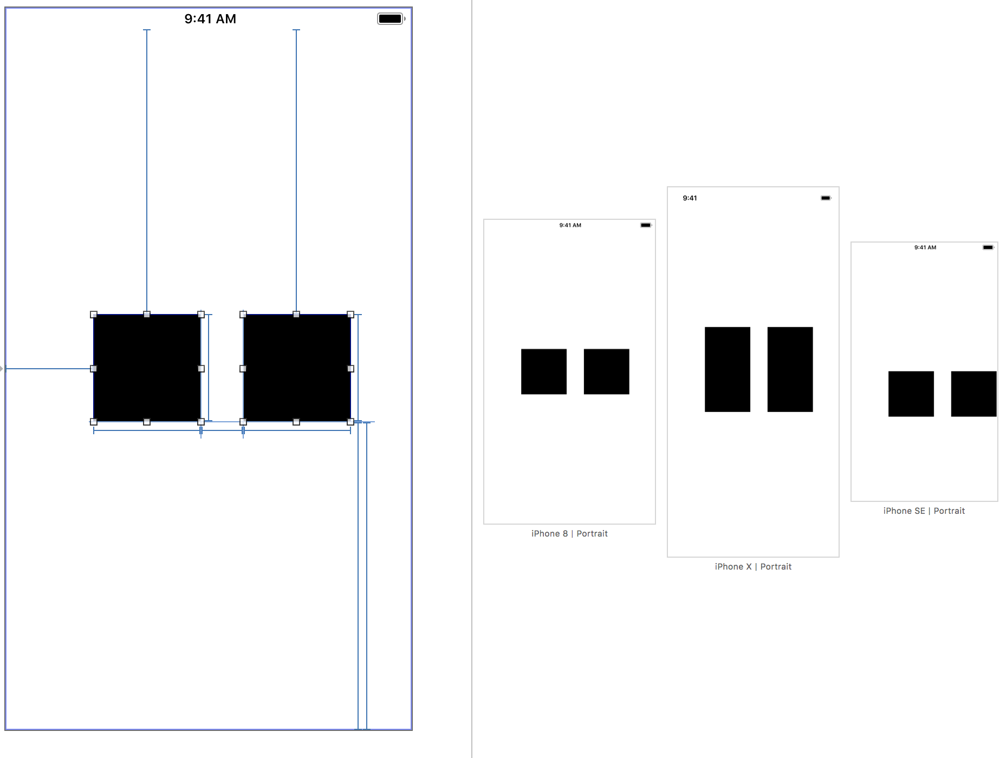

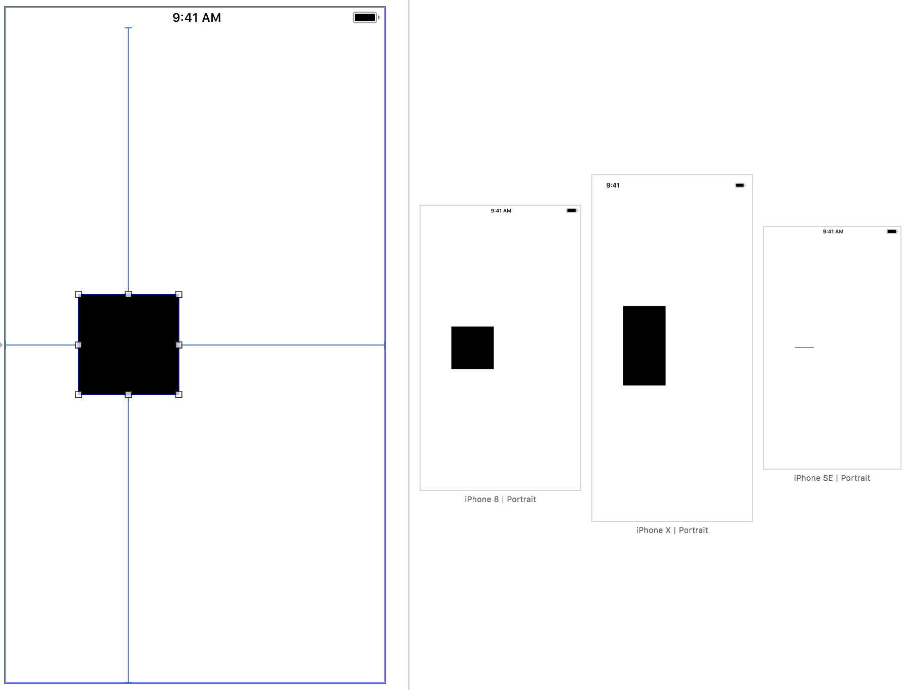

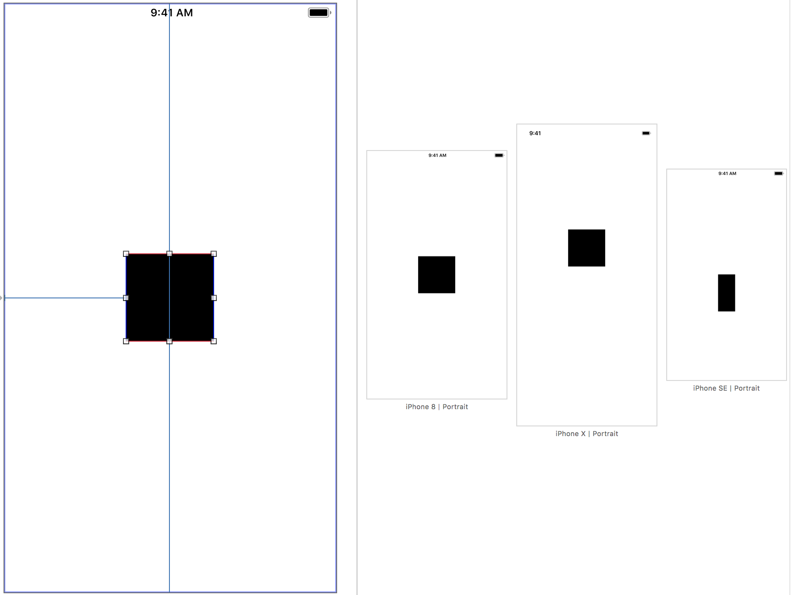

<br>

<br>

### Stroyboard Intrinsic Content Size

- Content(컨텐츠)가 본질적으로 가지는 크기입니다.
- Label을 예로들면 내부에 들어가는 텍스트의 개수, 폰트, 글자의 크기를 합쳐서 적용하고 나면  길이와 크기가 나오는데 해당 Label의 Intrinsic content size가 됩니다.
- UIView - No Intrinsic Content Size
- Silders - Dofines only the width (iOS)
- Labels, buttons, switches, text fields - Defines noth the height and the width
- Text views and image views - Intrinsic content size can vary.

<br>

<br>

####  Storyboard CHCR

- Intrinsic content size의 값을 기준으로 봤을때
- Content Hugging은 더이상 늘어나지 못하도록 최대 크기에 제한을 말합니다.
  - ~~Content의 size를 hugging한다고 생각하면 이해가 쉬울까~~
- Content Compression Resistance은 더 이상 줄어들지 못하도록 최소 크기에 제한을 말합니다.
  - ~~Intrinsic Size이하로 줄어들지 못하게 하는것을 말하는걸까~~

<br>

<br>

## Code

### NSLayoutConstraint 

> 참조 링크 : https://developer.apple.com/documentation/uikit/nslayoutanchor

```swift
// Creating constraints using NSLayoutConstraint
NSLayoutConstraint(item: subview,
                   attribute: .leading,
                   relatedBy: .equal,
                   toItem: view,
                   attribute: .leadingMargin,
                   multiplier: 1.0,
                   constant: 0.0).isActive = true

NSLayoutConstraint(item: subview,
                   attribute: .trailing,
                   relatedBy: .equal,
                   toItem: view,
                   attribute: .trailingMargin,
                   multiplier: 1.0,
                   constant: 0.0).isActive = true
```

1. subView의 .leading을 view의 .leadingMargin과 같게한다.(equal) 
2. subView의 .trailing을 view의 .trailingMarign과 같게한다.(equal)

<br>

<br>

### Autolayout Anchors

>  참고 링크 : https://www.raywenderlich.com/125718/coding-auto-layout

- iOS 9.0이상부터 사용이 가능합니다.

```swift
// Creating the same constraints using Layout Anchors
let margins = view.layoutMarginsGuide

subview.leadingAnchor.constraint(equalTo: margins.leadingAnchor).isActive = true
subview.trailingAnchor.constraint(equalTo: margins.trailingAnchor).isActive = true
```

1. subView의 .leading을 view의 .leadingMargin과 같게한다.(equal) 
2. subView의 .trailing을 view의 .trailingMarign과 같게한다.(equal)

<br>

#### Horizontal Layout Anchors 

- view의 수평선(Horizontal), X축에 관련된 제약조건으로 NSLayoutXAxisAnchor 클래스의 객체입니다.

```swift
Leading Anchor
Trailing Anchor
Left Anchor
Right Anchor
Center-X Anchor
```

###### Leading와 Left의 차이는 Left는 무조건 왼쪽이지만 Leading은 상황에 따라서(아랍어는 우측부터 읽는다) 우측이 되기도 좌측이 되기도 한다. (한국이나 미국에서는 좌측과 같습니다.) 

<br>

#### Vertical Layout Anchors

- view의 수직선(Vertical), Y축에 관련된 제약조건으로 NSLayoutYAxisAnchor 클래스의 객체입니다.

```swift
Top Anchor
Bottom Anchor
Center-Y Anchor
First baseline Anchor
Last baseline Anchor
```

###### First , Last baseline Anchor - Label에 시작줄과 끝줄

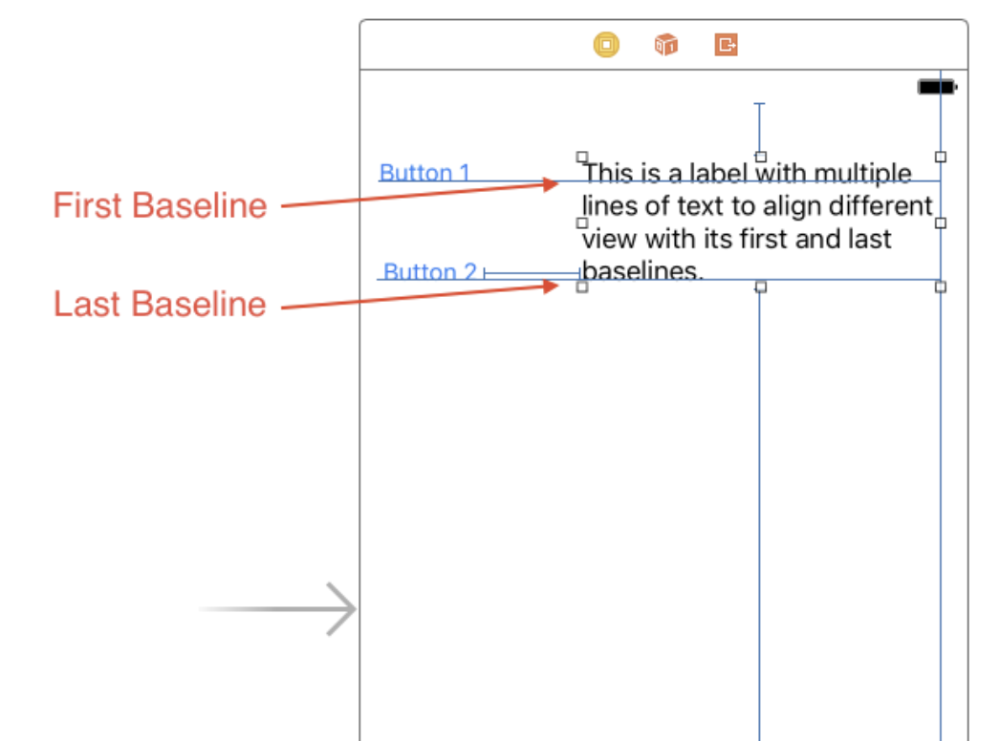

<br>

### Dimension Layout Anchors

- view의 크기를 정의하며 NSLayoutDemension 클래스의 객체입니다.

```swift
Width Anchor
Height Anchor
```

<br>

<br>


