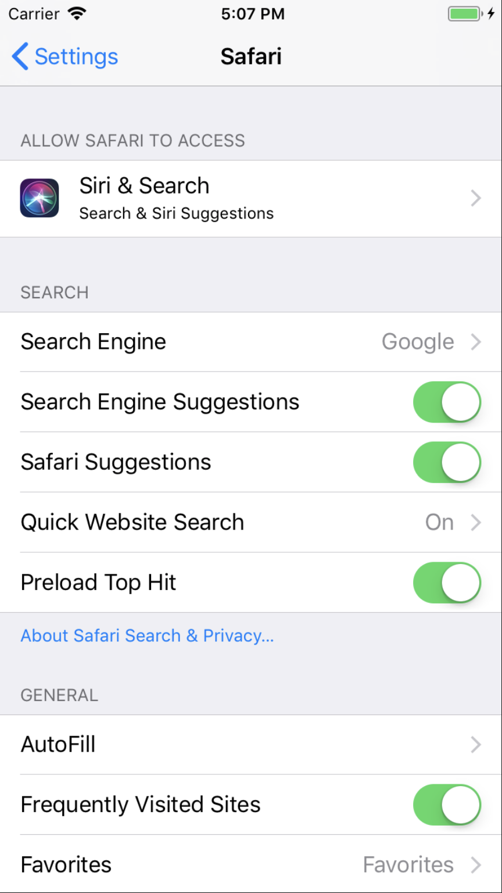
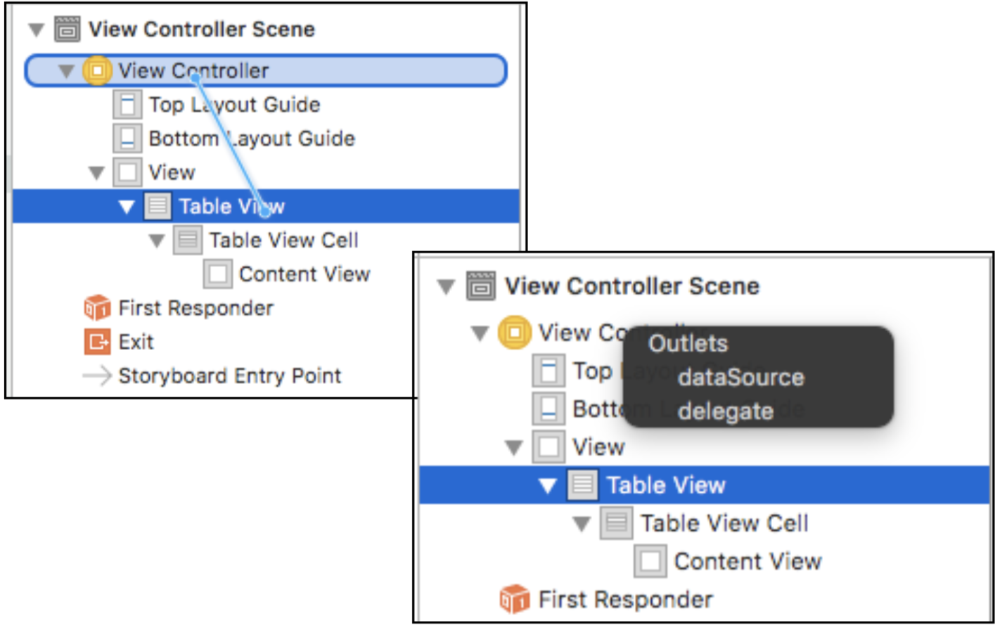
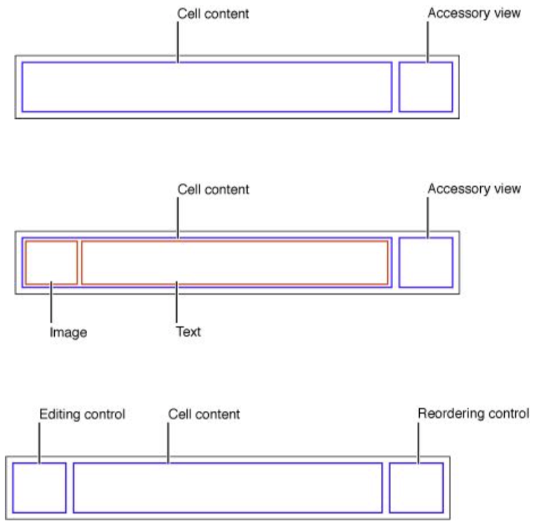
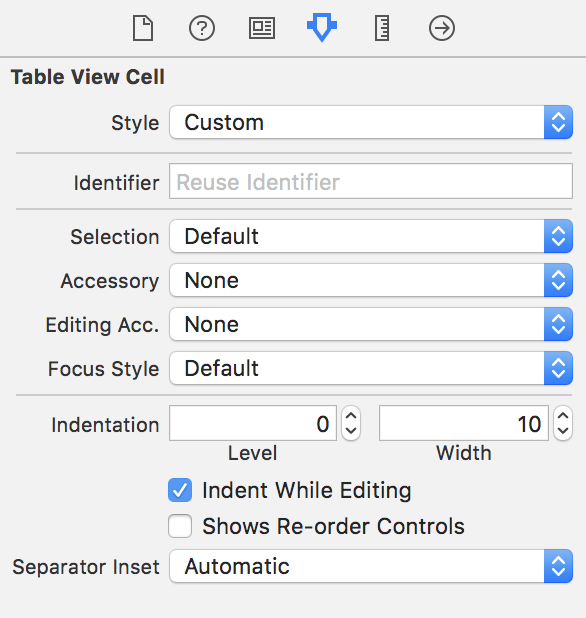
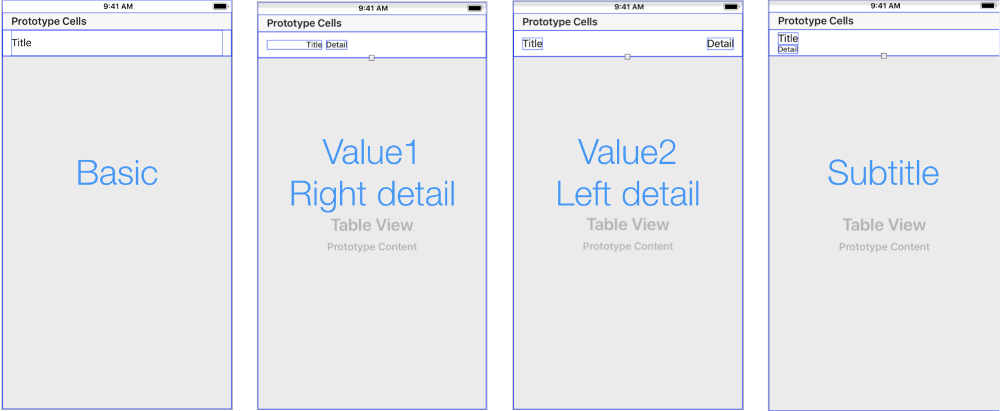

# UITableView

- UIScrollView를 상속받아 List 형태로 반복되는 아이템을 보여주기 위한 뷰
- 단일 열에 정렬된 행을 사용하여 데이터를 표기합니다.
- Plain Style / Grouped Style 

<br>

## Plain Style

- UITalbeView의 기본 스타일로 하나 이상의 섹션을 가질 수 있으며 각 섹션은 다시 하나 이상의 로우를 가지게 됩니다.
- 각 섹션별로 헤더 / 푸터 뷰를 가질 수 있으며, 섹션이 보여질때 헤더뷰는 Top에 푸터뷰는 Bottom에 고정됩니다.
- 섹션을 빠르게 검색하는 Indexed List 설정도 가능합니다.
- 전화번호부와 같은 스타일입니다.

<br>

<br>

## Grouped Style

- 관련된 하나의 그룹으로 그룹핑해서 표현이 가능합니다.
- 데이터 계층 구조에 대한 상세 정보를 표현하는데 적합합니다.
- 헤더 / 푸터를 가지고 있지만 Plain Style과 다르게 Top, Bottom에 고정되지는 않습니다.
- 주로 앱의 설정창이 Gruoun Style 로 구성되어 있습니다.

<br>



<br>

<br>

## UITableView DataSource

- TableView에서 표현할 데이터를 제공하는 데 사용하는 프로토콜입니다.
- 여러가지 method를 가지고 있지만 기본적으로 2개는 무조건 설정해 줘야 합니다.
- `public func tableView(_ tableView: UITableView, numberOfRowsInSection section: Int) -> Int { }` 는 섹션별 row의 갯수를 지정합니다.
- `public func tableView(_ tableView: UITableView, cellForRowAt indexPath: IndexPath) -> UITableViewCell { }` 는 UITableViewCell을 커스터마이징 할수 있습니다. 

```swift
let tableView = UITableView(frame: view.frame)
        
tableView.register(UITableViewCell.self, forCellReuseIdentifier: "table01")
tableView.dataSource = self
view.addSubview(tableView)

extension TableView02: UITableViewDataSource {
	public func tableView(_ tableView: UITableView, numberOfRowsInSection section: Int) -> Int {
	return 3
    }
    
	public func tableView(_ tableView: UITableView, cellForRowAt indexPath: IndexPath) -> UITableViewCell {
        let cell = tableView.dequeueReusableCell(withIdentifier: "table01")
	return cell
    }
}
```

<br>

<br>

## UITableView Delegate

- Interaction 과 관련된 동작을 커스터마이징하는 프로토콜들입니다.
- 이 외에 더 많은 Method가 있습니다.
- 셀을 재사용을 하면서 어떻게 동작하는지 확인해 봐도 좋습니다.
- `func tableView(_ tableView: UITableView, didSelectRowAt indexPath: IndexPath) { }` 셀을 선택하면 실행되는 method입니다.
- `func tableView(_ tableView: UITableView, willDisplay cell: UITableViewCell, forRowAt indexPath: IndexPath) { }` 는 테이블 뷰가 특정 행에 대해 셀을 그리려고 한다는것을 대리자에게 알립니다.
- `func tableView(_ tableView: UITableView, didEndDisplaying cell: UITableViewCell, forRowAt indexPath: IndexPath) { }` 는 특정 셀이 제거 되었음을 대리자 에게 알립니다.
- 위와같이 특정 상황에서 동작하는 method를 가지고 UITableView의 동작을 커스터마이징 할수 있습니다.

```swift
extension ViewController: UITableViewDelegate {   
	func tableView(_ tableView: UITableView, didSelectRowAt indexPath: IndexPath) {
        print("didSelectRowAt : \(indexPath.row)")
    }
  func tableView(_ tableView: UITableView, willDisplay cell: UITableViewCell, forRowAt indexPath: IndexPath) {
    print("Will Display Cell : \(indexPath.row)")
  }
  
  func tableView(_ tableView: UITableView, didEndDisplaying cell: UITableViewCell, forRowAt indexPath: IndexPath) {
    print("Did End Display Cell : \(indexPath.row)")
  }
}
```

<br>

<br>

## StoryBoard와 code로 DataSource & Delegate 사용하기

- 스토리보드는 테이블뷰를 사용하고자하는 뷰에 만들어 준다음 View Controller에서 control 키를 누르고 드래그하여 Table View로 이동하면 연결할수 있는 Outlets가 나오게 되며 사용하고자하는 dataSource 및 Delegate를 선택해 주면 됩니다.



<br>

- 코드로는 테이블 뷰를 사용하고 하는 뷰에서 다음과 같이 사용하면 됩니다.

```swift
class ViewController: UIViewController {
    let tableView = UITableView(frame: view.frame)
    tableView.dataSource = self
    tableView.delegate = self
}
```

<br>

<br>

## UITableView Cell

- TableView에서 사용하는 각 아이템을 담을 수 있는 컨테이너입니다.

<br>



<br>

- Default Style은 Cell Content / Accessory View를 가진 형태입니다.
- Cell Content는 textLabel, detailTextLabel, imageView를 가질수 있습니다.
- image가 들어가면 Image의 영역만큼 Text의 영역(textLable, detailTextLabel)이 줄어들게 됩니다.
- 커스텀마이징을 통해서 Cell의 형태를 변경할 수도 있습니다. (이미지의 위치를 변경하는거나 AccessoryView대신 button을 넣는것과 같은)

<br>

### StroyBoard에서의 UITableView Cell 만들기 

1. TableVeiw를 사용하고 하는 View에 올린후 오토레이아웃을 적용합니다.

2. TableVeiwCell을 TableView에 추가합니다.

3. 재사용시 필요한 Cell의 구분을위해 식별자(Identifier)를 추가합니다.

   - 식별자가 없으면 Cell을 구분할수 없기 때문에 꼭 해야 합니다.

     

<br>

<br>

## Code에서의 UITableView Cell 만들기

```swift
let tableView = UITableView(frame: view.frame)
tableView.register(UITableViewCell.self, forCellReuseIdentifier: "Cell")
view.addSubview(tableView)
```

1. TableView를 만들어고 frame size를 정해줍니다.
2. `.register` 을 사용해서 새로운 테이블 셀을 만드는데 필요한 클래스를 등록합니다.
3. `forCellReuseIdentifier` 에 재사용시 필요한 Cell의 구분을위해 식별자(Identifier)를 추가합니다.
4. `view.addSubview(tableView)` 를 해서 View에 올려줍니다.

<br>

<br>

### 셀의 재사용

- 한번에 많은 셀을 매번 생성, 해제를 하면 앱에 부담이 갈수 밖에 없기 때문에 재할당을 사용해서 화면에 보여지지 않는 부분의 셀을 재사용합니다.
- `tableView.dequeueReusableCell` 을 사용합니다.
- 재 사용된 셀에 indeaPath.row / indexPath.section과 같은 indexPath를 사용해서 셀에 맞는 정보를 넣어 줄수 있습니다.
- UITableView Delegate와 같이 사용해서 셀의 재사용 주기에 원하는 동작을 추가 할수 있습니다.

<br>

```swift
 func tableView(_ tableView: UITableView, cellForRowAt indexPath: IndexPath) -> UITableViewCell {
    let cell = tableView.dequeueReusableCell(withIdentifier: "Identifier", for: indexPath)
    return cell
  }
```

- `tableView.dequeueReusableCell(withIdentifier: <String>)` 은 반환값이 옵셔널 UITableViewCell? 입니다.
-  `tableView.dequeueReusableCell(withIdentifier: <String>, for: <IndexPath>)` 은 UITableViewCell로 옵셔널이 아닙니다.
- 상황에 맞게 옵셔널 타입을 사용해서 런타임에러와 같은 상황이 발생하지 않도록 해야합니다.

<br>

<br>

## UITableViewCell Style

```swift
let recell = UITableViewCell(style: <UITableViewCellStyle>, reuseIdentifier: <String?>)
```

- `style: UITableViewCellStyle.default, .value1, value2, subtittle` 을 사용해서 cell의 style을 정해 줄수 있습니다.



- 이외에도 직접 스타일을 만들어서 cellf을 만들어 준뒤 reuseIdentifier를 사용해서 재사용하여 사용도 가능합니다.


