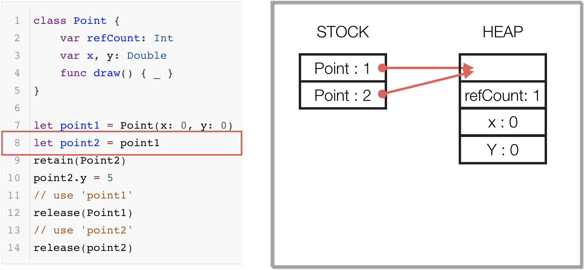
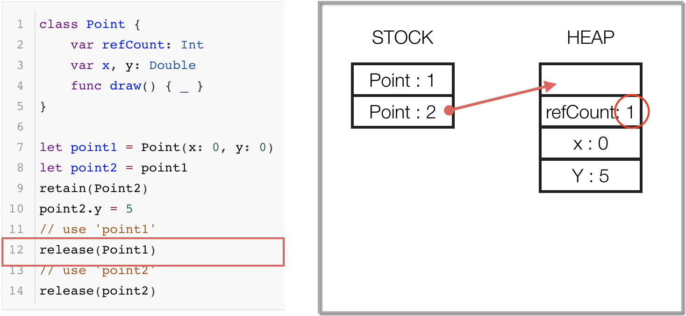
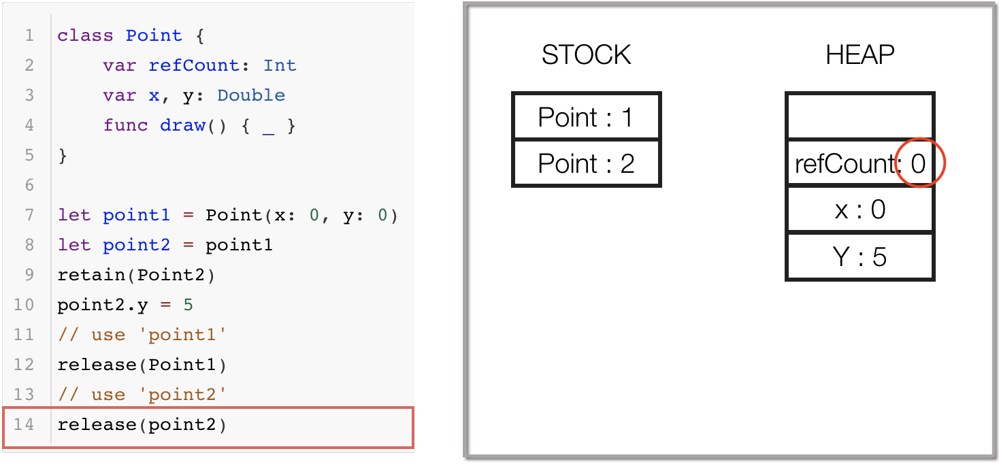
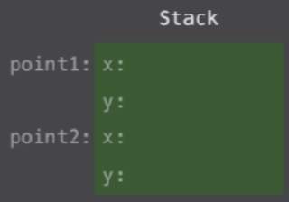
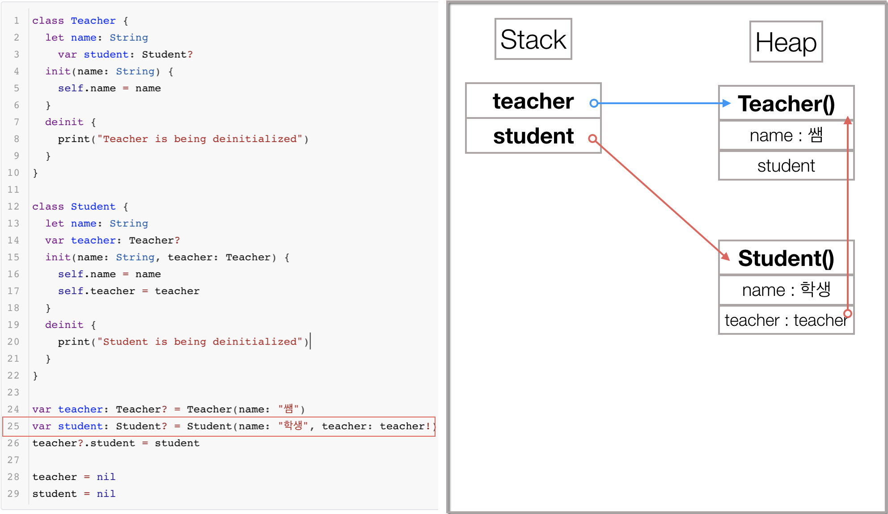
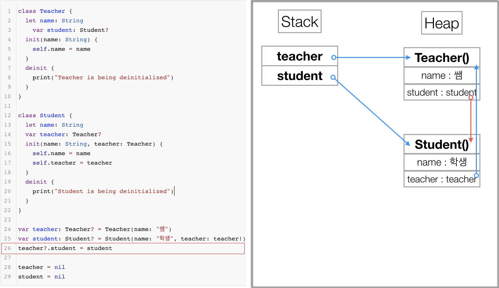
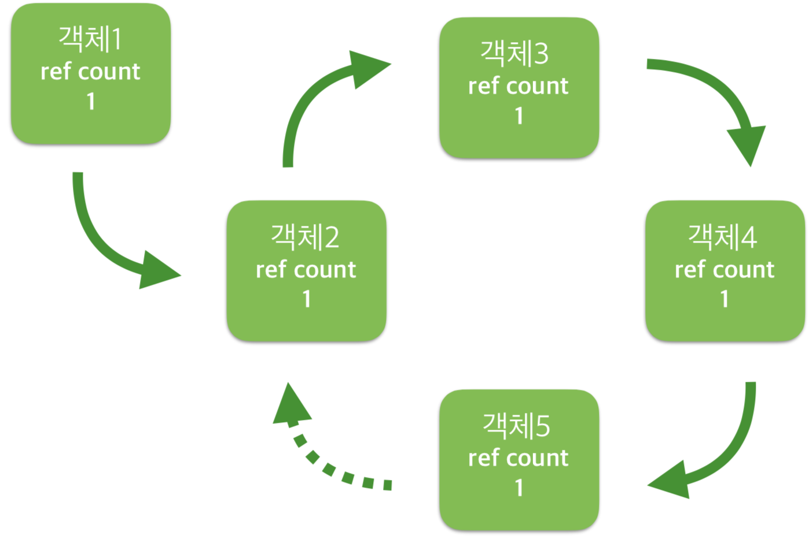
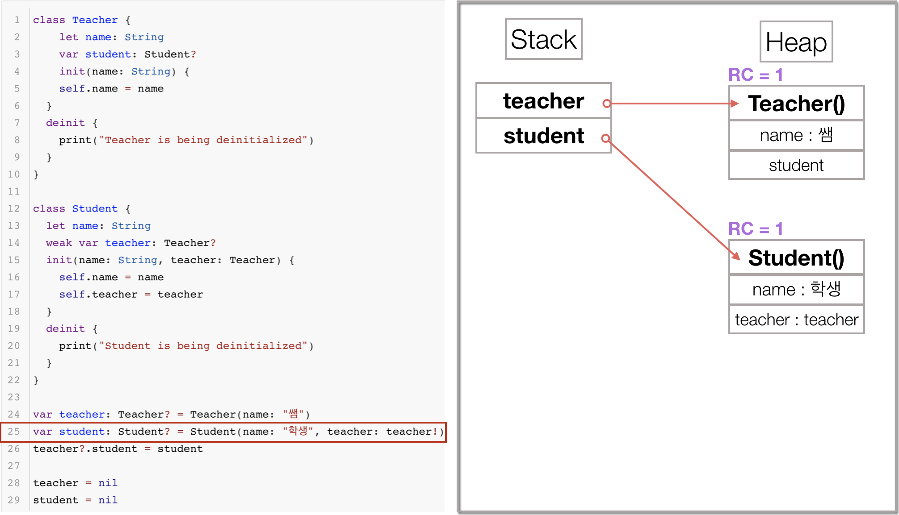
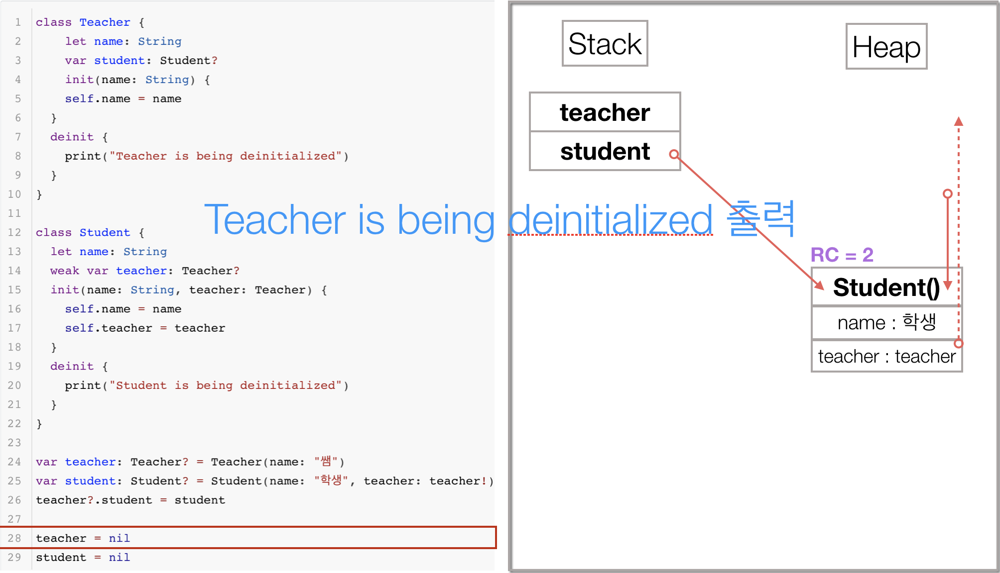
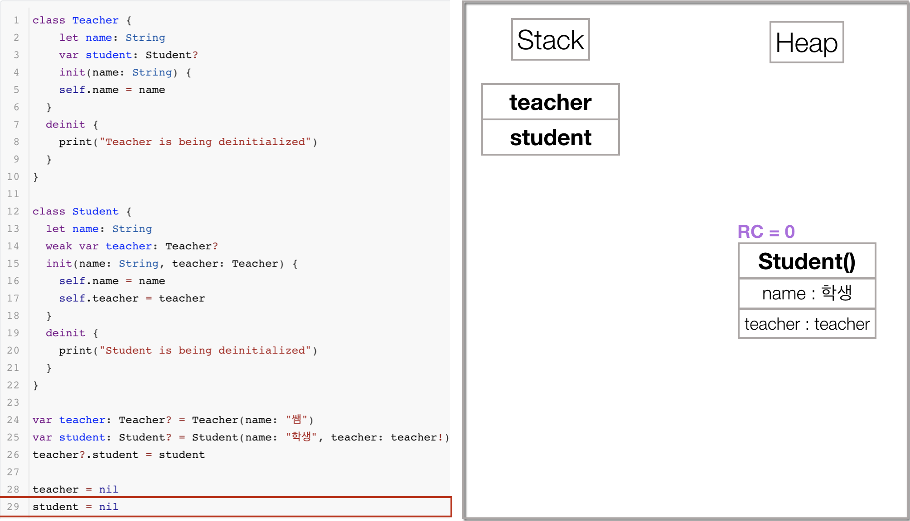

# Memory Management

<br>

<br>

<br>

## ARC가 나오기 이전

<br>

### Garbage Collection

- 정기적으로 Garbage Collector가 동작하여 더이상 사용되지 않는(필요없다고 판단되면) 메모리를 반환하는 형식입니다.
- iOS는 사용된적이 없고 OS X에서 지원했으나 Mountain Lion (버전 10.8)부터 사용할수 없게 되었습니다.

<br>

<br>

### Manual Retain-Release, Manual Referece Counting

- 메모리 관리 코드를 직접 호출해서 메모리를 할당해야 하기에 개발자기 직접관리를 해야 했습니다.

- RC(Reference Counting) 를 통해 메모리를 수동으로 관리한는 방식입니다.
- retain / release / autorelease 등의 메모리 관리 코드를 직접 호출 해야합니다.
- 개발자가 명시적으로 RC 를 증가시키고 감소시키는 작업 수행해야 합니다.

- RC 에 대한 이해 필요 (Reference Counting / Retain Count / Reference Count) 합니다.
- Objective-C 에서는 ARC를 해제하고 MRR을 사용할수 있습니다.


> Build Settings에서 Objective-C Automatic Reference Counting을 No라고 하면 사용이 가능

<br>

<br>

## 참조횟수 - Reference Counting

- Objective - C의 코드를 가지고 보면

<br>

```objective-c
int main(int argc, const char * argv[]) {
       
Person *man = [[Person alloc] init];			// count: 1
[man doSomething];

[man retain];									// count: 2
[man doSomething];
 
// [man release];
[man doSomething];								// count: 2
[man release];									// count: 1
[man release];									// count: 0
}
```

<br>

1. Person *man = [[Person alloc] init]; 할당하면서 RC가 1이 올라갑니다.
2. [man retain];	을 하면서 RC가 1이 올라가 2가 됩니다.
3. [man release];를 하면서 RC가 1이 내려가 1이됩니다.
4. [man release];를 하면서 RC가 1이 내려가 0이되면서 메모리(Heap)에서 파괴됩니다.

위의 코드의 과정을 이미지로 보면 다음과 같습니다.

<br>


1. ClassA의 객체가 생성되면서 Retain Count가 1이 올라갑니다.
2. ClassB를 retain하면서 Retain Count가 1이 올라가 2가 됩니다.
3. ClassA를 release하면서 Retain Count가 2에서 1이됩니다.
4. ClassB를 release하면서 Retain Count가 1에서 0이되면서 메모리에서 파괴됩니다.

<br>

<br>

## Leak vs Dangling Pointer

Retain Count가 0이 되면 메모리에서 해제되기 때문에 만들어지는 Count와 제거되는 Release는 균형이 맞아야 합니다.

- alloc , retain 이 많을 경우는 Memory Leak 발생
 하여 사용하지 않는데 객체가 남아있게 됩니다.
- release 가 많을 경우 Dangling Pointer (허상, 고아) 발생  하게 됩니다.
- 예를들어 0이되는 순간 객체는 메모리에서 해제되는데 같은 위치에서 Release는를 많이 해버려 다음과정이 -1이 되버리면, 이미 사라진(파괴된) 메모리 주소에 접근하는것과 같기 때문에 런타임 에러가 발생합니다.
- Dangling Pointer는 해제된 주소를 가르킨다는 겁니다.

<br>

<br>

이처럼 개발자는 새로운 개발을 할때마다 메모리를 직접 관리하기 위해 rules이나 conventions를 확인하고 많은 제약을 고려하면서 진행해야 했습니다. 물론 Xcode Static Analyzer와 같이 도와주는 툴들은 있었지만 그래도 메모리 관리는 쉽지 않았다고 합니다.

## 그래서 ARC가 등장하게 됩니다.

<br>

<br>

## ARC (Automatic Reference Counting) 

- 아마도 2011년에 등장

- RC 자동 관리 방식 (WWDC 2011 발표)  
- 컴파일러가 개발자를 대신하여 메모리 관리 코드를 적절한 위치에 자동으로 삽입이 됩니다.
-  GC 처럼 런타임이 아닌 컴파일 단에서 처리 하기 때문에 Heap 에 대한 스캔 불필요하고 앱 일시 정지 현상이 없습니다.
  - GC의 경우 런타임 중간 시스템이 전반적으로 메모리를 확인하는 타이밍이 있어서 한번에 처리하게 됩니다.
  - ARC의 경우 컴파일 단에서 회수하는 타이밍을 정하기때문에 런타임중에 Heap에 대한 스캔을 할 필요가 없게 됩니다.
- 
메모리 관리 이슈를 줄이고 개발자가 코딩 자체에 집중할 수 있도록 합니다.


- ARC는 Referenct Type에만 적용이 되기 때문에 클래스의 인스턴스에만 적용이 된다고 봐도됩니다.
- Struct나 Enum은 Value 타입이기 때문에 적용이 되지 않습니다.
- 활동화된 참조카운트(RC)가 하나라도 있을 경우 메모리에서 해제 되지 않습니다.
- 참조타입은 Strong, Weak, Unowned가 있는데 모든 타입이 RC가 올라가지는 않습니다.
  - 강한 참조 Strong는 기본값으로 참조가 될때마다 RC가 1 증가합니다.
  - 약한 참조 Weak나 미소유 참조 Unowned는 RC가 증가하지 않습니다.
  - Strong인 강한 참조를 사용할때는 참조들끼리 연결되어 RC를 계속 유지하는 강한 순환 참조를 주의해야 합니다.
- Strong : Var, Let, Optional, Non-Optional
- Weak: Var, Optional
- Unowned : Var, Let, Non-Optional

<br>

<br>

## 코드로 보는 ARC

아래 코드로 RC카운터가 생성되고 제거되는 과정을 보려고 합니다.

```swift
class Point {
    var x, y: Double
    func draw() { _ }
}

let point = Point(x: 0, y: 0)
let point2 = point1
point2.y = 5
```

<br>

이 코드는 다음과 같이 쓸수 있습니다.

```swift
class Point {
    var refCount: Int			// 객체로 만들면 refCount를 사용할 준비를 합니다.
    var x, y: Double
    func draw() { _ }
}

let point1 = Point(x: 0, y: 0)
let point2 = point1
retain(Point2)
point2.y = 5
// use 'point1'
release(point1)
// use 'point2'
release(point2)
```

<br>1

메모리에서의 동작과 같이 본다면

~~STOCK 는 오타입니다. STACK입니다.~~

1. 컴파일 단계에서 상수를 2개 사용해줄걸 알기에 Stack에 생성되어 있습니다.
2. `let point1 = Point(x: 0, y: 0)` 는 생성된 Point class의 인스턴스의 주소를 let point1에 넣어주게 됩니다.
   - Point class의 인스턴스(객체)는 Heap에 메모리에 x:0, y: 0을 가진 공간을 만들게 되면서 RC가 1이 올라갑니다. ( point1은 class Point를 참조하고 있는 상태입니다.)
3. `let point2 = point1` 을 하면 point1이 가지고 있는 인스턴스 주소를 point2도 가지게 됩니다. 
4. `retain(point2)` 에서는 point1과 point2가 같은 인스턴스 주소를 가지고 있게 되고 같은 인스턴스 주소를 가진다는건 같은 class를 참조하고 있다는거니까 RC는 2가 됩니다.
5. `point2.y = 5` 를 하면서 가르키고 있는 인스턴스의 주소의 y값을 변경하게 됩니다.
6. `release(point1)` 를 하면서 point1은 인스턴스를 가르키지 않습니다.
   - 인스턴스를 가르키지 않기때문에 RC가 빠지게 되어 RC = 1이됩니다.
7. `release(point2)` 를 하면서 point2는 인스턴스를 가르키지 않습니다.
   - 인스턴스를 가르키지 않기 때문에 RC가 1이 내려가게 되고 RC = 0이 됩니다.
8. RC가 0이되면서 HEAP에서 제거(파괴)됩니다.
9. 전체 Scope가 종료되면서 Stack에서 상수도 제거되게됩니다.










<br>

<br>

### Struct / Enum은 왜 안쓸까

Struct와 Enum은 Value 타입이기 때문입니다.

```swift
struct Point {
    var x, y: Double
    func draw() { _ }
}

let point1 = Point(x: 0, y: 0)
var point2 = point1
point2.x = 5
```

위와 같은 Struct가 있을때 메모리에 할당되는걸 보면

만들어져서 사용하는 방법은 class와 비슷하지만 Struct나 Enum은 Value 타입입니다.

Class와 다르게 같은 메모리 주소를 참조 하는게 아니라 값이 복사되어 Stack에 만들어지게 됩니다. 그렇기 때문에 RC(참조 카운트)가 필요없게 되고 사용이 완료되면 Stack에서 제거되게 됩니다.



실제로 복사되는 순간은 `point2.x = 5` 값이 변경되는 시점에 변경됩니다.

<br>

<br>

### Strong Reference Cycle 

- 객체에 접근 가능한 모든 연결을 끊었음에도 순환 참조로 인해 
 활성화된 참조 카운트가 남아 있어 메모리 누수가 발생하는 현상을 말합니다.
- 앱의 실행이 느려지거나 오동작 또는 오류를 발생시키는 원인이 됩니다.

```swift
class Teacher {
  let name: String
    var student: Student?
  init(name: String) {
    self.name = name
  }
  deinit {
    print("Teacher is being deinitialized")
  }
}

class Student {
  let name: String
  var teacher: Teacher?
  init(name: String, teacher: Teacher) {
    self.name = name
    self.teacher = teacher
  }
  deinit {
    print("Student is being deinitialized")
  }
}

var teacher: Teacher? = Teacher(name: "쌤")                                 
var student: Student? = Student(name: "학생", teacher: teacher!)              
teacher?.student = student                                                   

teacher = nil                                                              
student = nil
```

- 여기서 Reference Count를 가진건 Teacher()과 Student()입니다.
- Reference Count는 참조를 당할때마다 올라간다고 생각하면 이해가 좀 쉬울것 같습니다.

<br>

1. `var teacher: Teacher? = Teacher(name: "쌤")      ` 가 실행되면서 var teacher에는 class Teacher 인스턴스의 주소가 저장되면서 class Teacher의 RC = 1이 됩니다.

2. `var student: Student? = Student(name: "학생", teacher: teacher!)`  가 실행되면서 `var student`에는 class Student 인스턴스의 주소가 저장되면서 class Strudent의 RC = 1이 됩니다.

   그리고 `student.teacher`의 초기화 값으로 class Teacher 인스턴스 주소를 가지고 있는 `var teacher`을 할당하면서 class Teacher의 RC = 2가 됩니다.

3. `teacher?.student = student ` 를 실행하면서 class Student 인스턴스 주소를 가지고 있는 `var student`를 `teacher.student`에 할당해 주면서 class Student의 RC = 2가 됩니다.

4. `var teacher` 가 가지고 있던 class Teacher의 인스턴스 주소를 nil로 바꿔주었습니다.`teacher = nil, rc = 1` 

5. Reference count는 0이되어야 메모리에서 파괴되는데, 아직 카운터가 1이 남아 있기 때문에 메모리에서 남아 있습니다.

   - `student.teacher` 는 아직 class Teacher 인스턴스의 주소를 가지고 있습니다.

6. `student = nil` 을 해줘도 `teacher.student` 는 class Student의 인스턴스 주소를 가지고 있기 때문에 rc = 1이 남아 메모리에서 사라지지 않습니다.

7. 위와 같이 사용이 완료되었음에도 메모리에서 사라지지 않는 상태를 Memory Leak이 발생했다고 합니다. (OS에게 메모리를 반납하지 못하는 상황)

<br>







- 결국 Reference Count가 남아서 메모리에서 사리지지 않습니다.

<br>

<br>

### Weak Reference 

그럼 강한 순환 참조(Strong Reference Cycle)를 방지하는 방법이 있을까? 

여러가지 방법이 있겠지만 Weak(약한 참조)를 사용하는 방법이 있습니다.

<br>

#### Weak?

- 그림에서 점선 화살표가 weak으로 참조한 상태입니다. 
- weak는 약한 참조로 RC를 하지 않습니다. (참조를 해도 Reference Count가 올라가지 않습니다.) 
- 그렇지에 순환 참조 상태에서도 rc를 0으로 만들어 메모리에서 제거가 가능합니다.



<br>

```swift
class Teacher {
    let name: String
    var student: Student?
    init(name: String) {
    self.name = name
  }
  deinit {
    print("Teacher is being deinitialized")
  }
}

class Student {
  let name: String
  weak var teacher: Teacher?
  init(name: String, teacher: Teacher) {
    self.name = name
    self.teacher = teacher
  }
  deinit {
    print("Student is being deinitialized")
  }
}

var teacher: Teacher? = Teacher(name: "쌤")                                  
var student: Student? = Student(name: "학생", teacher: teacher!)              
teacher?.student = student                                                   

teacher = nil                                                              
student = nil
```

- Strong Reference Cycle에서 사용한 코드와 비슷한 코드입니다. 다른 곳은 `weak var teacher: Teacher?` 입니다.

  ```swift
  class Student {
    let name: String
    weak var teacher: Teacher?				// 여기! 여기가 다릅니다!
    init(name: String, teacher: Teacher) {
      self.name = name
      self.teacher = teacher
    }
    deinit {
      print("Student is being deinitialized")
    }
  }
  ```

  <br>

1. `var teacher: Teacher? = Teacher(name: "쌤")      ` 가 실행되면서 var teacher에는 class Teacher 인스턴스의 주소가 저장되면서 class Teacher의 RC = 1이 됩니다.

2. `var student: Student? = Student(name: "학생", teacher: teacher!)`  가 실행되면서 `var student`에는 class Student 인스턴스의 주소가 저장되면서 class Strudent의 RC = 1이 됩니다.

   그리고 `student.teacher`의 초기값으로 class Teacher 인스턴스의 주소를 저장하고 있는 `teacher`를 가져가게 되지만 Reference Count는 1이 증가되지 않습니다. 그 이유는 `weak var teacher: Teacher?` 처럼 weak을 사용해서 입니다. weak는 RC를 증가시키지 않으면서 참조를 시키는 약한 참조입니다.

3. teacher?.student = student를 하면서 Student의 RC도 1이 증가하게 되여 Studnet의 RC는 2가 됩니다.

4. 그런뒤 teacher = nil를 해주게 되면 teacher이 참조하고 있던 class Teacher 인스턴스의 주소가 nil값으로 변경되고RC가 1이 줄어들게 됩니다. 그러면서 class Teacher 인스턴스의 RC는 0이되고, RC = 0이 되면 메모리에서 제거되게되고 "Teacher is being deinitialized"를 출력하게 됩니다.

5. 그리고 메모리에서 제거되면서 teacher.student가 참조하고 있던 class Student의 참조 카운터가 1내려가게 되어 RC = 1이 됩니다.

6.  student = nil가 실행되면서 class Student 의 RC = 0이 되고 메모리에서 제거 되면서 "Student is being deinitialized"를 출력하게 됩니다.

<br>










