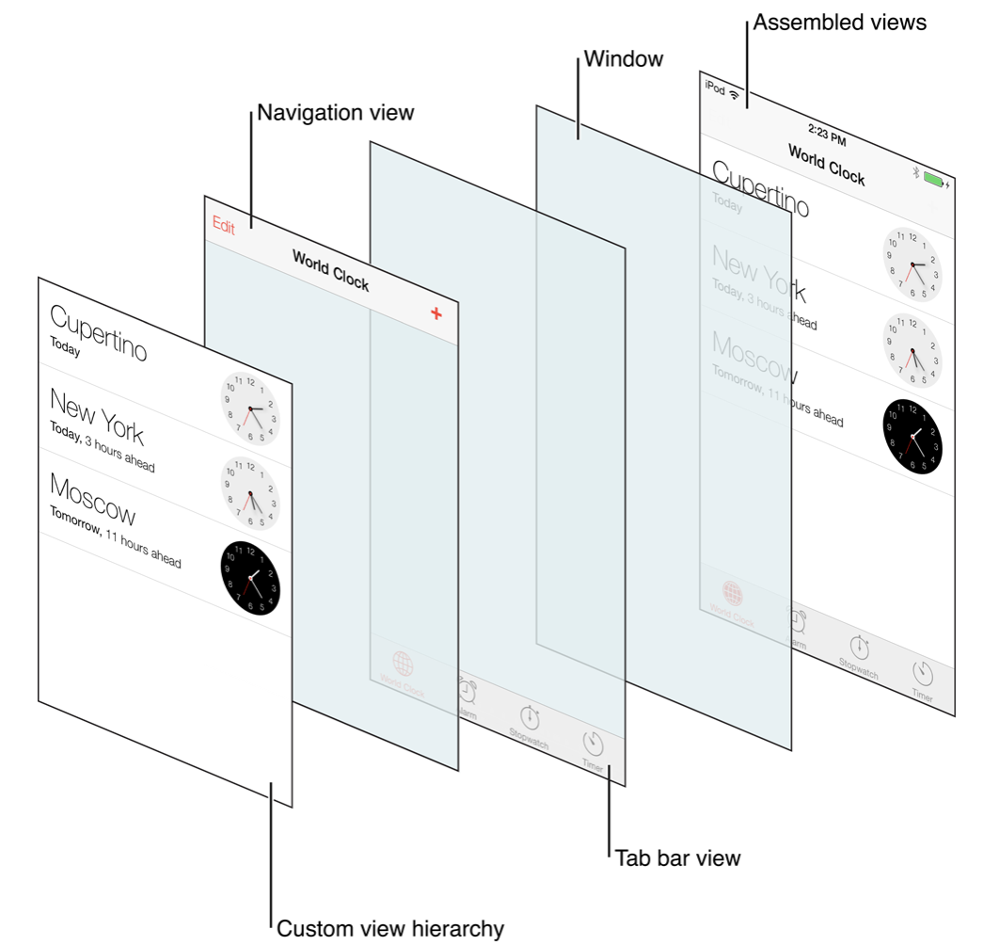
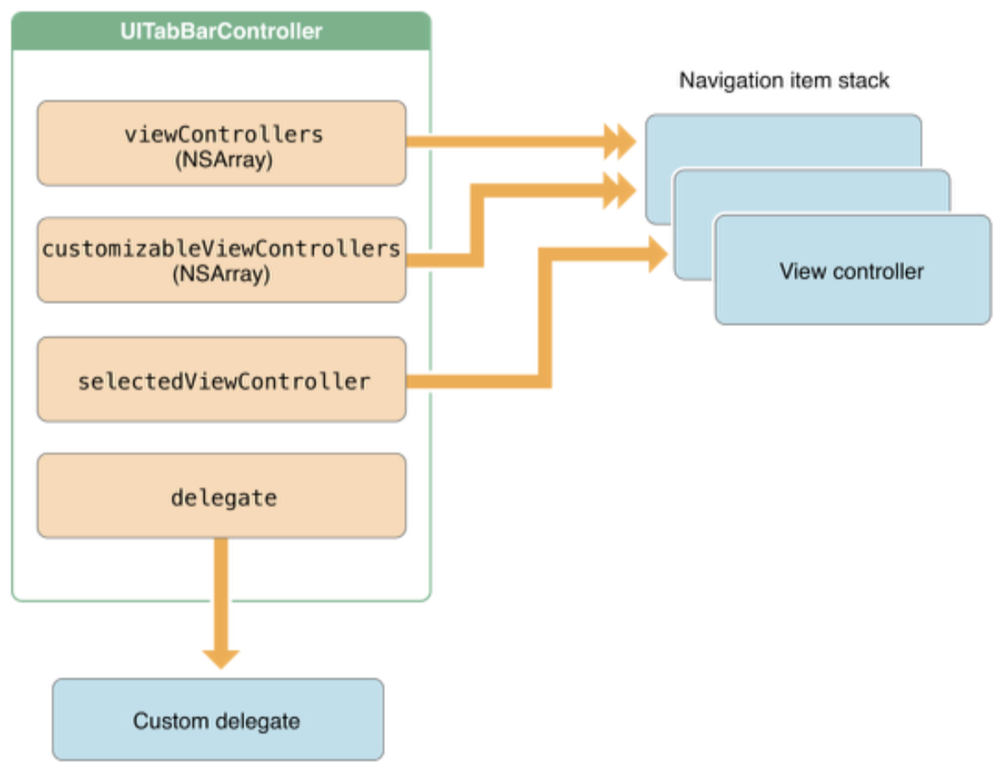
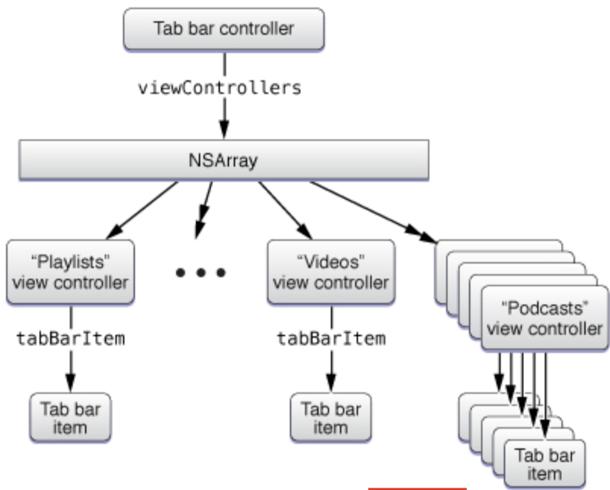

# UITabBarController

- A container view controller that manages a radio-style selection interface, where the selection determines which child view controller to display.
- 라디오 스타일의 선택 인터페이스를 관리하는 컨테이너 뷰컨트롤러 입니다.
- 라디오 스타일은 하나만 선택이 가능한 스타일입니다. (체크박스와 같이 중복으로 선택되는 스타일이 반대되는 스타일입니다.)

<br>

<br>

## The primary views of a tab bar controller

- 기본적인 Tab Bar Controller view입니다.
- Navigation View까지 추가한 상태입니다.



<br>

<br>

## Accessing the Tab Bar Controller Properties

```swift
var tabBar: UITabBar
```

- The tab bar view associated with this controller.
- 컨트롤러와 관련된 탭바뷰입니다. 
- 텝바를 컨트롤하는 속성에 접근이 가능합니다.

<br>

<br>

## Managing the View Controllers

```swift
var viewControllers: [UIViewController]?
```

- An array of the root view controllers displayed by the tab bar interface.
- 탭바의 인터페이스를 표시하는 루트뷰컨트롤러의 배열입니다.

```swift
func setViewControllers([UIViewController]?, animated: Bool)
```

- Sets the root view controllers of the tab bar controller.
- 탭바컨트롤러의 루트뷰컨트롤러를 추가(제거) 합니다.

```swift
var customizableViewControllers: [UIViewController]?
```

- The subset of view controllers managed by this tab bar controller that can be customized.
- 탭바 컨트롤러의 부분집합인 뷰컨트롤러의 관리를 할수 있고, 커스텀을 할수 있습니다.

```swift
var moreNavigationController: UINavigationController
```

- The view controller that manages the More navigation interface.
- More 네비게이션 인터페이스를 관리하는 뷰컨트롤러입니다.
- 탭바 컨트롤러는 5개 이상이 되면 커스텀을 하지 않는 이상 More로 표시됩니다.
- Navigation item stack에서 view Controller을 보여주는거기 때문에 moreNavigationController입니다.



<br>

<br>

## Managing the Selected Tab

```swift
var selectedViewController: UIViewController?
```

- The view controller associated with the currently selected tab item.
- 지금 선택한 텝 아이템과 연결되어 있는 뷰컨트롤러입니다.

```swift
var selectedIndex: Int
```

- The index of the view controller associated with the currently selected tab item.
- 지금 선택한 텝의 아이템과 연결되어 있는 뷰컨트롤러의 인덱스입니다. ( 인덱스로 값을 주고 싶을때 사용합니다.)

<br>

<br>

## UITabBar VS UIToolbar

- UITabBar는 하나 이상의 버튼을 이용해 서로 다른 작업이나 뷰, 모델등을 선택해 제어하기 위한 바이고, 앱의 모드를 변화시키기 위해 많이 사용합니다.
- UITabBar는 UITabBarController와 결합해 많이 쓰지만 단독으로 활용이 가능합니다.
- UIToolbar는 탭바와 비슷한 모양을 가지지만 사용 목적이 다릅니다.
  - 툴바는 현재 뷰컨트롤러의 컨텐츠에 관련된 액션을 수행하기 위한 것입니다.

<br>

<br>

## UITabBar Interface Builder Attributes

- UITabBar를 만들기 위해 사용가능한 속성입니다.
- programmatically으로 사용가능한 Type도 있습니다.

[UITabBar - Apple Developer](https://developer.apple.com/documentation/uikit/uitabbar?changes=_3)

| Attribute        | Discussion                                                   |
| ---------------- | ------------------------------------------------------------ |
| Background       | The background image to display for the bar. If you specify a stretchable image, the image is stretched to fit the available space; otherwise, the image is tiled. When you configure a background image, the tab bar ignores the tint color information. To set this attribute programmatically, use the [`backgroundImage`](https://developer.apple.com/documentation/uikit/uitabbar/1623469-backgroundimage?changes=_3) property. |
| Shadow           | The custom shadow image for the tab bar. This attribute is ignored if the tab bar does not also have a custom background image. To set this attribute programmatically, use the [`shadowImage`](https://developer.apple.com/documentation/uikit/uitabbar/1623452-shadowimage?changes=_3) property. |
| Selection        | The image to use for the selected tab. To set this attribute programmatically, use the [`selectionIndicatorImage`](https://developer.apple.com/documentation/uikit/uitabbar/1623456-selectionindicatorimage?changes=_3) property. |
| Image Tint       | The tint color to apply to the selected item. To set this attribute programmatically, use the [`tintColor`](https://developer.apple.com/documentation/uikit/uitabbar/1623460-tintcolor?changes=_3) property. |
| Style            | The basic style to apply to the bar. You can configure a tab bar with a dark or light style and the bar can be opaque or translucent. To set the style programmatically, use the [`barStyle`](https://developer.apple.com/documentation/uikit/uitabbar/1623454-barstyle?changes=_3) and [`isTranslucent`](https://developer.apple.com/documentation/uikit/uitabbar/1623458-istranslucent?changes=_3) properties. |
| Bar Tint         | The tint color to apply to the bar. To set this attribute programmatically, use the [`barTintColor`](https://developer.apple.com/documentation/uikit/uitabbar/1623445-bartintcolor?changes=_3) property. |
| Item Positioning | The positioning scheme to apply to items. Use this attribute to configure how items are spaced across the length of the tab bar. To set this attribute programmatically, use the [`itemPositioning`](https://developer.apple.com/documentation/uikit/uitabbar/1623468-itempositioning?changes=_3) property. |

<br>

<br>

## UITabBarITem 

- An item in a tab bar.

- 탭바의 item 항목입니다.

- 탭 모음은 한번에 하나의 항목을 선택하는 라디오 모드에서만 작동합니다. 탭 모음 항목을 선택하면 탭 모음 위의 보기가 전환됩니다.

- ```swift
  init(tabBarSystemItem: UITabBarItem.SystemItem, tag: Int)
  ```

-  시스템이 가지고 있는 항목중 하나를 선택합니다.

  ```swift
  init(title: String?, image: UIImage?, tag: Int)
  ```

- init(title:image:tag:) 사용자 아이템을 만들수 있습니다. 지정된 이미지나 타이틀을 사용할수 있습니다.

  ```swift
  init(title: String?, image: UIImage?, selectedImage: UIImage?)
  ```

- init(title:image:selectedImage:) 메소드를 사용하여 명시된 타이틀로 이미지를 지정할수 있습니다.

<br>

<br>

## More

- 5개 이상이 되면 More로 묶이게 됩니다.
- 아래와 같은 형태로 묶이게 됩니다.
- More는 Edit를 해줄수 있으며 Edit결과에 따라서 More외에 표시되는 탭바아이템을 선택 할수 있습니다.



<br>

<br>