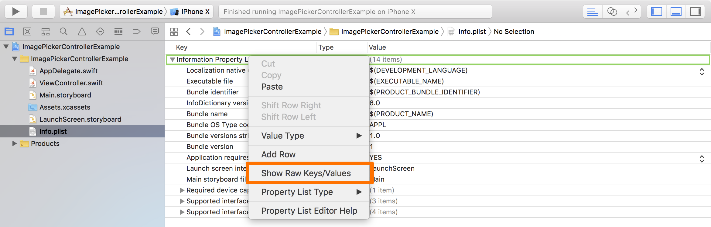
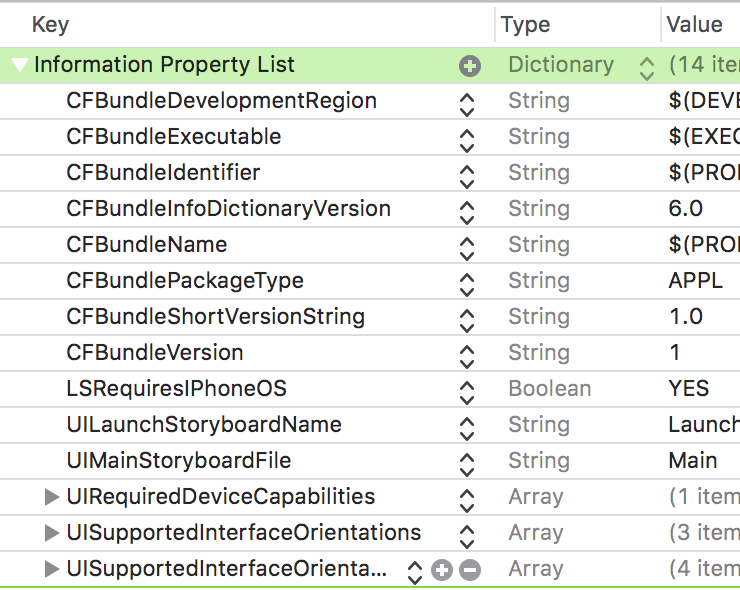

# UIImagePickerController

- A view controller that manages the system interfaces for taking pictures, recording movies, and choosing items from the user's media library.
- 카메라를 사용하고, 동영상을 찍고, 사용자의 미디어 라이브러리의 아이템을 선택하기 위한 시스템 인터페이스를 관리하는 뷰 컨트롤러입니다.

<br>

<br>

## Responding to Interactions with the Picker

- 델리게이트와 델리게이트 메소드를 사용하기위한 프로토콜입니다.

```swift
var delegate: (UIImagePickerControllerDelegate & UINavigationControllerDelegate)?
```

- The image picker’s delegate object.

```swift
protocol UIImagePickerControllerDelegate
```

- A set of methods that your delegate object must implement to interact with the image picker interface.

<br>

<br>

## Delegate

- ```swift
  public protocol UIImagePickerControllerDelegate : NSObjectProtocol {
      
      @available(iOS 2.0, *)
      optional public func imagePickerController(_ picker: UIImagePickerController, didFinishPickingMediaWithInfo info: [String : Any])
  
      @available(iOS 2.0, *)
      optional public func imagePickerControllerDidCancel(_ picker: UIImagePickerController)
  }
  ```

- `UIImagePickerControllerDelegate`는 2개의 메소드를 가지고 있는 Protocol입니다.

- 메서드를 언제 사용하는지는 이름을 확인 해 보면 알수 있습니다.

- `imagePickerController`는 imagePicker를 컨트롤 할수 있는 메서드 입니다.

- 델리게이트 해서 사용하면 parameter로 picker, info가 있습니다.

- picker는 피커 이미지 인터페이스를 관리하는 컨트롤 객체입니다.

- info은 이미지가 선택된 경우 원본이미지와 편집 된 이미지를 포함한 정보를 영상(movie)가 선택된 경우 파일 시스템 URL을  [String : Any]로 가져옵니다.

- `imagePickerControllerDidCancel`는 imagePickerController에서 Cancel을 선택된 뒤에 실행되는 메서드입니다.

  <br>

- `UIImagePickerController`의 델리게이트는 `(UIImagePickerControllerDelegate & UINavigationControllerDelegate)?` 2개를 프로토콜로 가지고 있기 때문에 전부 사용해 줘야 합니다.

  ```swift
  extension ViewController: UIImagePickerControllerDelegate, UINavigationControllerDelegate {}
  ```

- 델리게이트 메서드가 구현되어 있지 않으면 기본적으로 선택시 종료 되도록 구현 되도록 구현되어 있습니다.

<br>

<br>

## UIImagePickerControllerSourceType 

```swift
enum UIImagePickerControllerSourceType : Int
```

- The source to use when picking an image or when determining available media types.

  <br>

- 이미지 또는 사용가능한 미디어 타입을 결정할때 사용하는 소스입니다.

```swift
let type1 = UIImagePickerControllerSourceType.camera
let type2 = UIImagePickerControllerSourceType.photoLibrary
let type3 = UIImagePickerControllerSourceType.savedPhotosAlbum
```

<br>

<br>

## UIImagePickerController.isSourceTypeAvailable(type) 

```swift
class func isSourceTypeAvailable(_ sourceType: UIImagePickerControllerSourceType) -> Bool
```

- Returns a Boolean value indicating whether the device supports picking media using the specified source type.
- 장치가 명시된 소스 유형을 사용하여 미디어를 가져 올수 있는지를 부울값으로 반환합니다.

<br>

- Guard문과 같이 사용해서 현재기기에서 사용가능한지를 확인 할수 있습니다.

```swift
let type = UIImagePickerControllerSourceType.photoLibrary
guard UIImagePickerController.isSourceTypeAvailable(type) else { return }
```

- type은 UIImagePickerControllerSourceType 입니다

<br>

<br>

## 이미지 선택하기 - pickImage / .photoLibrary 

- 사진을 선택하면 뷰에 나오는 예제를 가지고 .photoLibrary를 알아보려고 합니다.

- .photoLibrary는 UIImagePickerControllerSourceType입니다.s

```swift
private let imagePickerController = UIImagePickerController()

@IBAction private func pickImage(_ sender: Any) {
    guard UIImagePickerController.isSourceTypeAvailable(.photoLibrary) else { return }
    imagePickerController.sourceType = photoLibrary
    present(imagePickerController, animated: true)
}
```

- 컨트롤러가 표시할수 있는 피커 인터페이스의 타입을 넣어준뒤 present 합니다.

<br>

- present까지 했기 때문에 pickImage 버튼을 클릭하면 포토라이브러리가 나옵니다.
- 그런데 종료를 하려고 우측 상단에 Cancel을 누르면 아무런 동작도 하지 않습니다.
- 이럴때 Delegate를 사용해야합니다.

```swift
final class ViewController: UIViewController {

    @IBOutlet private weak var imageView: UIImageView!
    private let imagePickerController = UIImagePickerController()

    override func viewDidLoad() {
        super.viewDidLoad()
        imagePickerController.delegate = self	// Delegate 위임자 지정
    }
    @IBAction private func pickImage(_ sender: Any) {
        guard UIImagePickerController.isSourceTypeAvailable(.photoLibrary) else {return}
        imagePickerController.sourceType = photoLibrary
        present(imagePickerController, animated: true)
    }
}

extension ViewController: UIImagePickerControllerDelegate, UINavigationControllerDelegate {
    
    func imagePickerController(_ picker: UIImagePickerController, didFinishPickingMediaWithInfo info: [String : Any]) {
        picker.dismiss(animated: true) 				// 사진을 선택하면 dismiss
    }
    func imagePickerControllerDidCancel(_ picker: UIImagePickerController) {
        picker.dismiss(animated: true)				// Cnacel을 누르면 dismiss
    }
}
```

- UIImagePickerController의 델리게이트를 사용할 때 주의할 점은 `UIImagePickerController`의 델리게이트는 `(UIImagePickerControllerDelegate & UINavigationControllerDelegate)?` 2개를 프로토콜로 가지고 있기 때문에 전부 사용해 줘야 합니다.

- 이제 포토 라이브러리가 나오고 난 다음 Cancel을 누르면 dismiss가 됩니다.

  <br>

- 이제 포토라이브러리에서 사진을 선택하면 화면에 나오게 하려합니다.

- 그런데 사진 라이브러리까지는 나오는데 거기서 사진을 선택하면 아래와 같은 문장이 나오면서 런타임 에러가 나오게 됩니다.

- This app has crashed because it attempted to access privacy-sensitive data without a usage description.  The app's Info.plist must contain an NSPhotoLibraryAddUsageDescription key with a string value explaining to the user how the app uses this data.

- 사용법 설명없이 개인 정보에 민감한 데이터에 액세스하려고했기 때문에이 앱이 다운되었다고 나옵니다. 앱의 Info.plist에는앱에서 민감한 데이터를 사용하는 방법을 사용자에게 설명하는 문자열 값이 포함 된 NSPhotoLibraryAddUsageDescription 키가 있어야한다고 나옵니다.

<br>

<br>

### NSPhotoLibraryAddUsageDescription 등록 방법

- 민감한 정보들을 사용할때는 Info.plist에서 키를등록해 줘야 합니다. 카메라를 사용하려고 하거나 사진을 사용하거나 녹음을 할때도 그에 맞는 키를 등록해 줘야 합니다.

   

- 우선 info.plist에 가서 Information Property List를 Key/Value값으로 보이게 클릭합니다.

  

- 변경된 모습입니다.

- 이제 Information Property List에 우측에 +를 누른뒤에 NSPhotoLibraryAddUsageDescription를 추가해줍니다.

- 그리고 Value에는 앱의 사용자가 어떤 권한을 줘야 하는지를 알수 있는 문장을 입력해 줍니다. 

- 녹화를 하거나 소리를 레코드하는것과 같은 사용자의 정보를 사용할때와 위와 같은 방법을 사용해서 키를 등록해 줘야 합니다.

<br>

<br>

- 이제 권한도 얻었으니 포토라이브러리에서 사진을 선택하면 화면에 나오도록 해보겠습니다.

```swift
final class ViewController: UIViewController {

    @IBOutlet private weak var imageView: UIImageView!
    private let imagePickerController = UIImagePickerController()

    override func viewDidLoad() {
        super.viewDidLoad()
        imagePickerController.delegate = self
    }
}

extension ViewController: UIImagePickerControllerDelegate, UINavigationControllerDelegate {
    func imagePickerController(_ picker: UIImagePickerController, didFinishPickingMediaWithInfo info: [String : Any]) {
        let originalImage = info[UIImagePickerControllerOriginalImage] as? UIImage
        imageView.image = originalImage 
    }
}
```

- `info[UIImagePickerControllerOriginalImage]` 의 값은 Any타입으로 나오기 때문에 UIImage로 타입캐스팅 해줘야 합니다. 사용되는 키값에 따라서 타입캐스팅해줘야 하는 타입이 다르기 때문에 Definition에서 확인이 가능합니다.

  ```swift
  // info dictionary keys
  public let UIImagePickerControllerMediaType: String // an NSString (UTI, i.e. kUTTypeImage)
  public let UIImagePickerControllerOriginalImage: String // a UIImage
  public let UIImagePickerControllerEditedImage: String // a UIImage
  public let UIImagePickerControllerCropRect: String // an NSValue (CGRect)
  public let UIImagePickerControllerMediaURL: String // an NSURL
  ```

- 위와 같은 방법을 사용해서 선택된 이미지를 오브젝트로 받아와서 사용할 수 있습니다.

<br>

<br>

## 사진 에디트 모드 적용하기

- 사진을 촬영하려고 하면 `UIImagePickerControllerSourceType`을 `.camera`로 주면 됩니다.

```swift
final class ViewController: UIViewController {

    @IBOutlet private weak var imageView: UIImageView!
    private let imagePickerController = UIImagePickerController()

    override func viewDidLoad() {
        super.viewDidLoad()
        imagePickerController.delegate = self
    }

    @IBAction private func takePicture(_ sender: Any) {
        print("\n---------- [ takePicture ] ----------\n")
        let type = UIImagePickerControllerSourceType.camera
        guard UIImagePickerController.isSourceTypeAvailable(type) else { return }
        imagePickerController.sourceType = type
        present(imagePickerController, animated: true)
        imagePickerController.allowsEditing = true
    }
}

extension ViewController: UIImagePickerControllerDelegate, UINavigationControllerDelegate {
    func imagePickerController(_ picker: UIImagePickerController, didFinishPickingMediaWithInfo info: [String : Any]) {
        let originalImage = info[UIImagePickerControllerOriginalImage] as? UIImage 
        let editedImage =  info[UIImagePickerControllerEditedImage] as? UIImage
        let selectedImage = editedImage ?? originalImage
        imageView.image = selectedImage

    }
    picker.dismiss(animated: true)
}
```

- 그리고 사진을 촬영후에 편집(크롭과 같은)을 하려고 하면 `imagePickerController.allowsEditing = true` 을 하면 됩니다.
- `.allowsEditiong`는 사용자가 선택한 스틸 이미지 또는 동영상을 편집 할 수 있는지 여부를 나타내는 부울 값입니다.
- 그리고 선택한 이미지와 에디트 한 이미지를 구분하여 `imageView.image`에 넣어줍니다.

<br>

<br>

##동영상 촬영 

- 동영상을 촬영하려면 `UIImagePickerControllerSourceType`을 `.camera`로 한 뒤에 mediaTypes를 정해주면 됩니다.

- `.mediaTypes`을 사용해서 어떤 미디어 타입을 사용할건지를 알려줘야 합니다.

  - `.mediaTypes`은 미디어 피커 컨트롤러가 엑세스할수 있는 미디어 유형을 나타내는 배열입니다. (An array indicating the media types to be accessed by the media picker controller.)
  - 또 이 속성은 기본적으로는 kUTTTypeImage으로 설정되어 있어서 미디어 탐색을 할 때 미디어의 스틸 이미지만 표시하도록 지정되어 있습니다. 그래서 동영상 캡처 인터페이스를 지정하거나 저장된 미디어를 탐색할때 동영상을 표시하도록 지정하려면 kUTTypeMovie 식별자를 사용해야 합니다.

- kUTTypeMovie식별자를 사용하기 위해서는 `import MobileCoreServices`를 해야합니다.

- `MobileCoreService`는 Use uniform type identifier (UTI)를 사용할수 있게 합니다.

  - [UTI 란?](https://developer.apple.com/library/archive/documentation/FileManagement/Conceptual/understanding_utis/understand_utis_intro/understand_utis_intro.html)
  - 데이터 유형을 식별하는 방법이 급증하고 있기에 개발에 어려움을 느낄수 있어서 애플에서 만든 통일된 타입의 식별자 입니다.
  - 각 UTI는 특정 파일 유형, 데이터 유형, 디렉터리 또는 번들 유형등에 대한 고유한 식별자를 제공하게 됩니다.
  - 특정 유형에 대한 다른 유형 식별자 네임 스페이스를 하나의 UTI하에 그룹화 할수 있으며, 유틸리티 기능은 한 형식에서 다르 형식으로 변환 할수 있습니다.
  - 언젠가 더 알아봐서 정리해보길

- 이제 Import를 했으면 그 타입을 사용해서 .mediaTypes를 지정해 줘야 합니다.

  ```swift
  var mediaTypes: [String] { get set }
  ```

- mediaTypes는 [String]으로 get, set이 되기 때문에 `[kUTTypeMovie as String]` 로 타입캐스팅하면 됩니다.

```swift
import UIKit
import MobileCoreServices

final class ViewController: UIViewController {

    @IBOutlet private weak var imageView: UIImageView!
    private let imagePickerController = UIImagePickerController()

    override func viewDidLoad() {
        super.viewDidLoad()
        imagePickerController.delegate = self
    }

        @IBAction private func recordingVideo(_ sender: Any) {
        
        guard UIImagePickerController.isSourceTypeAvailable(.camera) else { return }
        imagePickerController.sourceType = .camera
        imagePickerController.mediaTypes = [kUTTypeMovie as String]
        imagePickerController.cameraCaptureMode = .video
        imagePickerController.cameraDevice = .front
        imagePickerController.cameraFlashMode = .auto
        present(imagePickerController, animated: true)
        
    }
}

extension ViewController: UIImagePickerControllerDelegate, UINavigationControllerDelegate {
    func imagePickerController(_ picker: UIImagePickerController, didFinishPickingMediaWithInfo info: [String : Any]) {
    picker.dismiss(animated: true)
}
```

- 이제 .photoLibary를 사용했을때와 같이 사용자에게 민감한 정보를 접근 하려고 할때 사용할 Key을 등록해 줍니다. `NSMicrophoneUsageDescription`(마이크 사용), `NSCameraUsageDescription`(카메라 사용) 

- 이제 카메라 사용이 가능합니다.


<br>

<br>

## 사진과 카메라 같이 사용하려면?

- `imagePickerController.mediaTypes`을 사진과 카메라 모두 넣어주면 됩니다.
- `imagePickerController.mediaTypes`의 디폴트 값은 Image입니다.
- 같이 사용하기 위해서 `[kUTTypeImage as String, kUTTypeMovie as String]` 를 사용하면 됩니다.

```swift
@IBAction private func takePictureWithDelay(_ sender: Any) {

    guard UIImagePickerController.isSourceTypeAvailable(.camera) else { return }
    imagePickerController.sourceType = .camera
    
    imagePickerController.mediaTypes = [kUTTypeImage as String, kUTTypeMovie as String]
	present(imagePickerController, animated: true)
}
```

<br>

<br>

## 사진 촬영에 딜레이를 주고 싶으면?

- presnet를 할때 Delay를 사용하면 됩니다.

- presnet의 Paragmeter는 다음과 같습니다.

- ```swift
  func present(_ viewControllerToPresent: UIViewController, animated flag: Bool, completion: (() -> Void)? = nil)
  ```

- completion은` present` 가 완료된 후 실행할 블록입니다.

- 이 블록에는 반환 값이 없으며 매개 변수를 사용하지 않습니다. 이 매개 변수에는 0을 지정할 수 있습니다.

- 이 클로져는 강한 참조가 발생할수 있기 때문에 `[weak self]` 을 사용해야 합니다.

```swift
present(imagePickerController, animated: true) {
    [weak self] in
    DispatchQueue.main.asyncAfter(deadline: .now() + 3, execute: {
        self?.imagePickerController.takePicture()
    })
}
```

<br>

<br>

## 사진과 동영상을 저장 사용자의 앱에 저장하고 싶을때는?

- `UIImageWriteToSavedPhotosAlbum` 을 사용해서 사진을 저장할수 있습니다.

  - ```swift
    func UIImageWriteToSavedPhotosAlbum(_ image: UIImage, _ completionTarget: Any?, _ completionSelector: Selector?, _ contextInfo: UnsafeMutableRawPointer?)
    ```

  - Adds the specified image to the user’s Camera Roll album.

  - 사용자의 카메라 롤 앨범에 지정된 이미지를 추가합니다.

  <br>

- `UISaveVideoAtPathToSavedPhotosAlbum`를 사용해서 영상을 저장 할수 있습니다.

  - ```swift
    func UISaveVideoAtPathToSavedPhotosAlbum(_ videoPath: String, _ completionTarget: Any?, _ completionSelector: Selector?, _ contextInfo: UnsafeMutableRawPointer?)
    ```

  - Adds the movie at the specified path to the user’s Camera Roll album.

  - 지정된 경로의 동영상을 사용자의 카메라 롤 앨범에 추가합니다.

```swift
extension ViewController: UIImagePickerControllerDelegate, UINavigationControllerDelegate {
    func imagePickerController(_ picker: UIImagePickerController, didFinishPickingMediaWithInfo info: [String : Any]) {
        let mediaType = info[UIImagePickerControllerMediaType] as! NSString
        if UTTypeEqual(mediaType, kUTTypeMovie) {
            let url = info[UIImagePickerControllerMediaURL] as! NSURL
            if let path = url.path {
                UISaveVideoAtPathToSavedPhotosAlbum(path, nil, nil, nil)
            }
        } 
        else {
            let originalImage = info[UIImagePickerControllerOriginalImage] as? UIImage 
            let editedImage =  info[UIImagePickerControllerEditedImage] as? UIImage
            let selectedImage = editedImage ?? originalImage
            imageView.image = selectedImage

            if let saveimage = selectedImage {
                UIImageWriteToSavedPhotosAlbum(saveimage, nil, nil, nil)
            }
            
```

- `UTTypeEqual`은 2개의 유형 식별자가 동일한지를 비교하여 부울값을 반환하게 됩니다.
- 그렇기 때문에 사용된 mediaType이 kUTTypeMovie이면 해당 media의 url을 받아온뒤 `url.path` 를 접근해서 save 할수 있습니다.
- url.path를 사용하는 이유는 UISaveVideoAtPathToSavedPhotosAlbum이 string값을 받기 때문입니다.


