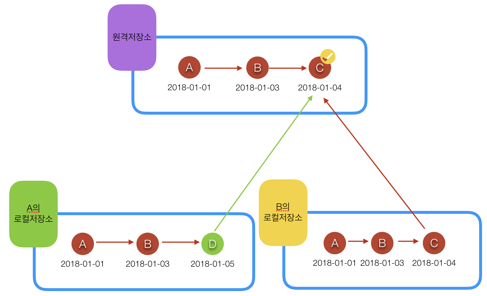

# Git Workflow

- centralized workflow
- Feature branch workflow
- gitflow workflow
- forking workflow

 

 

## Centralized workflow

- 중앙집권(?) 방식입니다.

- 1개의 원격 저장소를 만들어 사용하는데 프로그램을 만들때 1개의 원격저장소에서 가져와서 만든뒤에 다시 원격저장소로 올리는 방식입니다.

- 혼자서 작업할때는 크게 문제가 될게 없지만, 여러명에서 할경우 push를 하는 과정에서 문제가 발생할 가능이 있습니다.

  

- 예를들어 2명의 개발자가 1개의 원격저장소를 가지고 작업을 한다고 가정해보겠습니다.

  - 작업의 진행 순서는 다음과 같았습니다.

  1. 우선 원격 저장소에는 A라는 파일이 있었습니다.
  2. 개발자 A는 자신의 로컬 저장소로 A를 clone해 와서 개발을 한 뒤에 B로 commit해서 다시 원격 저장소로 push 했습니다.
  3. 그 뒤에 개발자 B는 원격저장소에서 A와 B를 clone 해서 작업을 한 뒤에 C로 만들어서 commit한뒤 원격저장소로 push를 했습니다.

  - 여기까지는 아무런 문제가 발생하지 않았습니다. 

  4. 그 뒤에 개발자 A는 자신의 로컬 저장소에서 작업을 이어서 한뒤 D로 commit를 해서 원격 저장소로 push를 하려고 했습니다.

  - 여기서 에러가 발생합니다. 이유는 개발자 A가 가지고 있는 저장소는 최신 버전이 아니기 때문입니다.

   

   

  - 또 다른 예로 개발자 A와 B가 같은 파일을 받아서 같은 파일에 대해 작업을 시작한뒤에 원격 저장소에 올린뒤에 FullRequests를 해주려고 하면 에러가 발생합니다.
  - 어떤 파일을 mearge해야 되는지를 git이 알수 없기 때문입니다.
  - 위와 같은 상황을 해결하기 위해서는 1명의 작업이 끝나면 원격 저장소에 올린뒤 다른 개발자가 pull(업데이트)을 해서 자신의 파일을 최신화 한 다음에 작업을 해서 원격 저장소에 올려 PR을 해줘야합니다.

 

 

## Feature branch Workflow

- 위와 같이 Centralized workflow 방식은 중앙에서 1개의 원격저장소를 사용하기 때문에 mearge를 하는 과정에서 문제가 발생할 가능성이 높습니다.

- 그것을 보안한 workflow가 Feature Branch Workflow입니다.

- 이름 그대로 Feature한 branch를 만들어서 사용하는 방식입니다.

- branch는 다음과 같습니다.

  - 모든 상태(커밋 정보, 파일변경내용등)를 저장하는 공간을 만들수 있습니다.
  - 가지를 친다라고 생각하면 이해가 쉬울것 같습니다.
  - 깃에서 처음 저장소를 만들면 branch는 master 입니다.
  - 파일을 commit 하게 되면 branch에 기록이 됩니다.

- 이런 특성을 가진 branch들을 기능별?(login, tableview)로 만들어서 사용하는 방식입니다.

- 원격 저장소에 branch를 만들고 그 기능을 구현할 개발자별로 해당 branch를 clone해서 작업을 하는 방식입니다.

- 이렇게 작업을 하면 원격 저장소에 있는 저장소와 로컬 저장소가 같음을 유지할수 있기 때문에 Centralized workflow에서 발생할수 있는 문제들을 예방할수 있습니다.

   

- 본격적인 사용 방법을 보면 다음과 같습니다.

  1. 로그인 페이지를 구현할 개발자 A와 채널뷰를 구현할 개발자 B가 있다고 가정합니다.
  2. 또 이들은 1개의 원격 저장소를 가지고 있습니다.
  3. 작업을 하기 위해서 개발자 A와 B는 같은 원격저장소를 자신들의 로컬 저장소로 clone 해오게 됩니다.
  4. 그리고 branch를 사용해서 A는 branch login을 B는 branch channel을 만들어 주고 그 브런치에서 개발을 시작합니다.
  5. 그런뒤에 원격저장소에 push를 해줄때는 자신이 작업하고 있는 branch까지 push를 합니다.
  6. 그럼 원격 저장소에는 2개의 branch가 추가되어 총 3개의 brnach(master, login, channel)이 생성되게 됩니다.

  - 이렇게 하면 협업을 진행하는 개발자의 commit에 관계없이 개발자 본인이 원하는 기능에 대해서 마음대로 작업이 가능합니다. (본인이 담당하는 branch에 push가 되기 때문입니다.)

  7. 그렇게 작업을 진행하다가 기능들을 합쳐서 하나의 프로그램으로 만들어야 한다고 할때PR을 사용해서 각 branch들을 master와 하나씩 merge합니다.

- PR도 이력이 남기 때문에 checkout을 통해서 원하는 PR 시점으로 돌아갈수 있습니다.

 

 

## gitflow Workflow

- Feature Branch Workflow를 배포하는 방법중에 하나입니다.
- 각자의 branch를 만들어서 작업을 하는건 동일한데, PR을 세부적으로 나눠놓은 방법입니다.
- 각자의 branch외에 Develop, release를 만들어서 상황에 따라서 merge를 하는 방법입니다.
- Develop은 개발자 개인이 사용하고 있는 brach에서 개발이 완료된 기능을 Develop에 merge 하는 branch입니다.
- release는 배포 전 버전별로 branch를 만들어 놓은 branch입니다. release가 될때마다 branch를 추가해서 관리합니다.
- Release brach를 왜 버전별로 관리해야 할까? 
  -  버전 1.5까지 배포가 된 프로그램이 있는데 1.2버전에서 버그가 발생한 상황이라고 가정합니다.
  - 우선 release brach에 버전별로 관리가 되어 있기 때문에 1.2버전을 clone해와서 테스트를 해보고 버그를 해결합니다.
  - 그리고 버그가 해결된 1.2버전을 Developer branch에 marge를 해줍니다.
  - 그리고 1.2버전과 1.5버전을 비교한 뒤에 1.5버전에서도 문제가 발생한다면 해결을 하고 발생하지 않는다면 1.6버전으로 release에 branch를 만들어 줍니다.
- Master branch에는 배포가 완료된 release의 branch를 marge합니다.
- 만약 새로운 개발자가 프로젝트의 중간부터 들어온다면 그 개발자는 master에 있는 버그가 없는 버전을 clone해와서 작업을 진행하게 됩니다.

 

 

## forking workflow

- Github의 fork를 사용하는 방법입니다.
- 떠오고 싶은 저장소를 pork해 오면 개인의 원격 저장소로 저장소 자체를 떠 올수 있습니다.
- PR을 만들어서 꼭 반영해줬으면 하는 부분을 저장소의 담당자에게 보낼수 있습니다.

 

 

