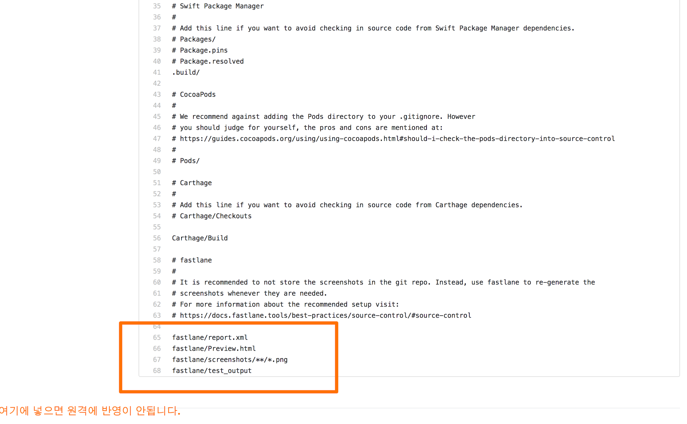
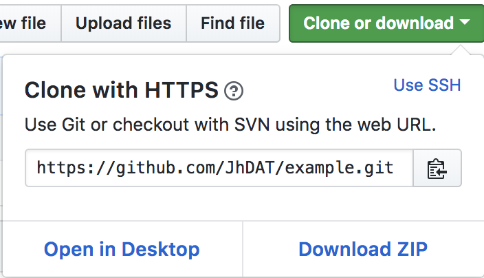
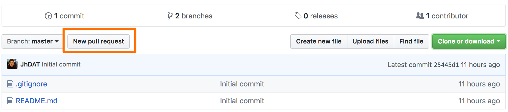
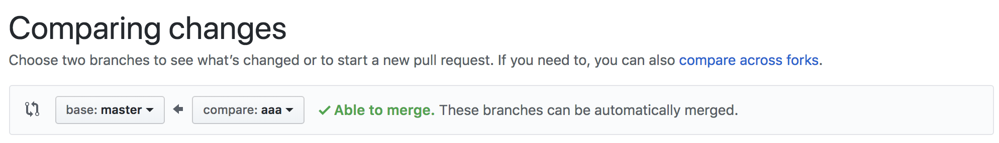

# Git

- 소스 분산형 버전 제어 시스템
- git과 github는 다르다.

<br>

<br>

## Git Repository

- 깃에서의 파일 변경 이력 저장소를 부르는 말입니다.
- local과 Remote Repository로 나누어집니다.

- local repository
  - 내 PC에 저장되는 개인 저장소입니다.
- Remote repository
  - 파일이 원격 저장소 전용서버에서 관리되는 저장소입니다.
  - GitHub는 원격 저장소에 해당됩니다.

<br>

<br>

## Git의 기본적인 상태

- Git은 파일을 committed, Modified, Staged 상태로 관리합니다.
- Committed 상태란
  - 데이터가 Local Repository에 안전하게 저장된 상태를 의미합니다.
- Modified 상태란
  - 파일을 수정했지만 Staging Area에 추가하지 않은 상태를 말합니다.
- Staged 상태란
  - 파일을 수정하고 Staging Area에 추가한 상태를 말합니다.
  - 현재 수정한 파일을 곧 commit 할 것이라고 표시한 상태를 의미한다.

<br>


출처 : [시작하기-Git-기초](https://git-scm.com/book/ko/v1/%EC%8B%9C%EC%9E%91%ED%95%98%EA%B8%B0-Git-%EA%B8%B0%EC%B4%88)

<br>

<br>

## 용어 정리

- git branch
  - 모든 상태(커밋 정보, 파일변경내용등)를 저장하는 공간을 만들수 있습니다.
  - 가지를 친다라고 생각하면 이해가 쉬울것 같습니다.
  - 깃에서 처음 저장소를 만들면 branch는 master 입니다.
  - 파일을 commit 하게 되면 branch에 기록이 됩니다.

  <br>

- git status

  - 파일의 상태를 확인할수 있습니다.
  - 현재 branch가 어디인지에 대한 정보를 알수 있습니다.
  - 파일이 *Tracked*(관리대상) 인지 *UnTracked*(관리대상 아님)인지 알수 있습니다.

  <br>

- Tracked

  - *Unmodified*, *Modified*, *Staged* 로 나눌수 있습니다.

  - *Staged* 는 commit 직전의 상태이며, 터미널에서 초록색으로 표시됩니다.

  - *Modified* 는 수정이 된 상태의 파일을 나타내며, 터미널에서 붉은색으로 표시됩니다.

  - *Unmodified* 는 그외에 모든 파일입니다.

    

    <br>

- git add

  - Modified 상태의 파일을 staged상태로 만드는 명령어 입니다.

    <br>

- git commit

  - 파일 변경 시점을 저장소에 기록할수 있습니다.

  - 시간 또는 버전의 순서대로 기록이 되기 때문에 버전별로 기록하거나 특정시점을 기준으로 기록하면 이력관리를 할수 있습니다.

  - 저장소에 기록이 되면 unmodified 상태가 됩니다.

    <br>

- git checkout

  - 다른 브랜치로 돌아 가고 싶을때 사용하는 명령어 입니다.

  - `git checkout <브랜치이름>` 을 사용해서 현재 브랜치에서 나와 다른 브랜치로 이동합니다.

    <br>

- git push

  - 원격 저장소로 변경된 파일을 업로드 하는것을 말합니다.

  - 변경 이력이 원격 저장소에 저장되어 로컬 저장소와 동일하게 만들수 있습니다.

    <br>

- git clone

  - 원격 저장소를 로컬 저장소로 다운 받는것을 말합니다.
  - 특정 시점의 원격저장소를 다운받아서 로컬 저장소에서 작업 할수 있습니다.

<br>

<br>

## Remote Repository에서 로컬록 clone 해보기

- GitHub는 원격 저장소입니다. GitHub에 Repository를 만들어 준뒤 Local Repository로 Clone해보겠습니다.

<br>

1. 깃허브에 Remote repository를 만들어 봅니다.

2. 생성시 `Add .gitignore`를 저장소에서 사용하고자 하는 언어로 정해주면 .gitignore 파일이 같이 생성됩니다

   - .gitignore 파일에서는 원격에 적용하고 싶지 않은 파일 리스트를 만들어줄수 있습니다.

     

3. 만들어진 Remote Repository를 Local Repository로 다운로드 받습니다.

   1. 깃허브의 Clone or download에 들어가 주소를 복사합니다.

      - 

   2. 터미널을 실행합니다.

   3. 복사를 하고자 하는 디렉토리로 이동한 후 `git clone <복사한 주소>` 를 입력합니다.

   4. 다운로드가 진행되고 완료가 되면 복사를 진행한 디렉토리로 이동해서 `git status` 를 입력합니다. 아래와 같이 나오면 정상적으로 복사가 된 상태입니다.

      ```
      $ git status
      On branch master
      nothing to commit, working directory clean
      ```

<br>

<br>

## Local Repository에서의 git

- git branch
  - 모든 상태(커밋 정보, 파일변경내용등)를 저장하는 공간을 만들수 있습니다.
  - 가지를 친다라고 생각하면 이해가 쉬울것 같습니다.
  - 깃에서 처음 저장소를 만들면 branch는 master 입니다.
  - 파일을 commit 하게 되면 branch에 기록이 됩니다.

<br>

1. 터미널을 실행합니다.

2. clone 된 local Repository가 있는 디렉토리로 이동합니다.

3. `git branch`를 입력합니다. `* master`  가 나오면 정상입니다.

4. `git checkout -b <생성할 브런치 이름>` 을 입력합니다.

   - 예를들어 aa라는 이름의 브런치를 생성하고 싶으면 `git checkout -b aa` 를 입력합니다.

5. `git branch` 를 입력합니다. 아래와 같이 나오면 정상적으로 브랜치가 추가되었습니다.

   ```
   * aa
     master
   ```

<br>

6. `git branch`를 입력합니다. `* aa, master`  가 나오면 정상입니다.

7. `touch bbb.txt` 를 입력해서 bbb.txt 파일을 만들어 줍니다.

8. `ls` 를 입력해서 디렉토리 내의 파일 리스트를 확인합니다. 아래와 같이 나오면 정상입니다.

   ```
   README.md	bbb.txt
   ```

<br>

9. 이전에 새롭게 만들어준 branch에 파일을 추가해 줬습니다. `ls` 를 입력해서 디렉토리 내의 파일 리스트를 확인합니다. 

   ```
   README.md	bbb.txt
   ```

10. 그 상태에서 `git status` 를 입력합니다.
    1. 현재 상태를 보면 다음과 같습니다.
    2. aa라는 브랜치에 bbb.txt라는 Untracked(관리 대상이 아닌) 상태인 파일이 생성되었다. (파일을 새로 만들어준건 기존에 디렉토리와 비교했을때 수정된것과 같습니다.)

    ```
    On branch aa
    	
    Untracked files:
    
      (use "git add <file>..." to include in what will be committed)
    
    	bbb.txt	// 붉은색으로 표시
    
    nothing added to commit but untracked files present (use "git bbb" to track)
    ```

11. 이제 우리는 git에게 수정된 파일(*Modified* 상태의 파일)을 commit 할것이라고 알려줘야 합니다. 그때 사용하는 명령어가 `git add` 입니다.

    - `git add` 를 사용하면 modified 상태의 파일을 staged 상태로 변경할수 있습니다.
    - staged 상태는 commit을 할 준비가 끝난 상태입니다.
    - `git add .` 을 사용하면 폴더 전체에 modified 상태의 파일을 staged 상태로 변경할수 있습니다
    - `git add <적용할 파일>` 을 사용해서 파일마다 commit 할 준비를 할수 있습니다.

12. `git add .` 을 입력하고 다시 `git status`를 입력합니다.

    ```
    On branch aa
    
    Changes to be committed:
      (use "git reset HEAD <file>..." to unstage)
    
    	new file:   bbb.txt	// 초록색으로 표시
    ```

    - on branch 는 aa 입니다.
    - bbb.txt는 staged 상태입니다.

13. `git commit` 을 입력합니다.
    - vi 가 실행됩니다.
    - `i`를 누르면 Insert 상태가 됩니다.
    - commit 메세지를 입력합니다.
    - 내용 작성이 완료되면 esc를 눌러서 Insert를 종료합니다
    - :wq 를 입력해서 commit를 입력합니다.
      - :q 는 저장하지 않고 종료합니다.
      - !를 붙이면 강제로 종료합니다.
14. 다시 파일을 수정하면 위와 같은 과정을 반복하면됩니다.

<br>

<br>

- #### 간단하게 Local Repository에서 git을 다루는 방법을 알아봤습니다.

<br>

<br>

## 로컬저장소에서 원격 저장소로 업로드 하기

1. 터미널을 실행합니다.
2. 올리고자 하는 디렉토리로 이동합니다.
3. `git push origin <올리고자 하는 브랜치>` 를 입력합니다.
4. 위의 예를 이어서 하면 `git push origin aa`가 됩니다.
5. 원격 저장소에가서 확인해 보면 branch aa가 추가된것을 알수 있습니다.

<br>

<br>

## branch를 추가해준 상태에서 마스터만 다른 디렉토리로 클론을 하면 어떻게 될까

1. 터미널을 실행합니다.
2. 클론되어 있는 폴더에서 빠져나온다음 새로운 폴더를 만들어줍니다.
   - `mkdir 폴더이름` 를 사용하면 새로운 폴더를 생성 할 수 있습니다.
3. 새롭게 만들어준 폴더에 깃허브에서 branch를 마스터로 한다음 클론을 할 주소를 가져옵니다.
4. `git clone 주소` 를하면 원격 저장소에 있는 자료를 다운로드 할 수 있습니다.
5. 그리고 clone이 완료되면 `git branch` 를 입력해 보면 master만 있는 것을 알수 있습니다. (위에서 부터 따라했다면 원격저장소에 branch는 aa와 master이 있습니다.)

- 이처럼 master를 clone하게 되면 master만 다운로드를 받게 됩니다.
- 여기서 알수있는건 branch aa와 master는 같은 선 상에 있다고 봐야 한다는겁니다.. (aa가 master에 속해 있는것이 아닙니다.)

<br>

<br>

##  로컬 저장소에서 - branch aa와 master의 변경이력을 합치는 방법

- Branch aa에서 변경한 이력을 master에도 적용해서 변경이력을 합칠수도 있습니다.
- pull은 원격 저장소에서 로컬 저장소로 업데이트를 실행합니다.
  - clone는 다운로드, pull은 업데이트입니다.
- pull을 실행하면 원격 저장소에서 최신 변경 이력을 다운로드 하여 내 로컬 저장소에 그 내용을 적용합니다.
- 그런데 만약 여러명에서 1개의 원격 저장소를 가지고 작업을 한다고 가정했을때 내가 pull을 실행한 뒤에 다른 사람이 push를 하여 원격 저장소를 업데이트 한 뒤에 내가 다시 push를 하려고 하면 push 요청이 거부되어 버립니다. (원격 저장소에 더 최신 파일이 있기 때문입니다.)
- 이런 경우에는 병합 merge라는 작업을 진행하여 다른 사람의 업데이트 이력을 내 저장소에도 갱신 해줘야 합니다. 만약 병합을 하지 않을 채로 이력을 덮어쓰게 되면 다른이 사람이 push한 업데이트 내역이 사라져 버리게 됩니다.

<br>

<br>

## PR - GitHub에서 변경이력을 합치는 방법

- PR(Pull Requests)를 사용합니다.
- GitHUb에 들어가서 원격 저장소를 선택합니다.

1. New Pull request를 선택합니다.

   

2. base와 compare에서 merge(병합)할 branch를 선택합니다.

   - Compare에서 base로 merge 됩니다.

   

3. 원하는 제목과 내용을 입력한 뒤에 Create pull request를 선택합니다.

   

4. 두개의 brach를 merge하는데 이상이 없다면 *This branch has no conflicts with the base branch* 라는 문구가 나오게 됩니다.

   - 만약 문제가 있다면 붉은색으로 나오면서 어느 부분에서 merge가 안되는지를 표시해줍니다.

5. 그 뒤에 코멘트를 달고 commit하거나 merge를 하면 안되면 안되는 내용을 적고 close Full Request를 할 수도 있습니다.

<br>