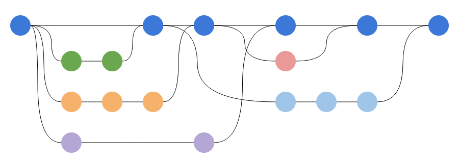
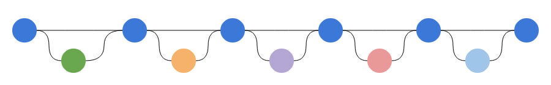

# fork를 사용해서 깃허브 브런치 관리하기

<br>

- git clone -b <branch> <remote_repo>
  - 리모트에 있는 브런치만 clone하고 싶을때 사용합니다.

## fork 한 저장소 최신화 하는 방법

- 로컬저장소에 fork 저장소 github 주소 추가 (from upstream 생성)
  1. $git remote -v
  2. $git remote add upstream <fork 저장소 주소>
  3. $git remote -v
     - 여기까지 진행할경우 remote 주소에 upstream이 추가되어 있습니다.
- 로컬 저장소에 clone 한 fork 저장소를 원격 저장소와 동기화 하기 from upstream 최신화)
  1. $git fetch upstream Develop
     - 리모트 서버로부터 저장소 정보를 동기화(머지를 안함) pull 은 로컬에 머지까지 함
  2. $ git checkout -b master --track origin/master 
     - 위 명령어는 . 같은 이름을 가진 brnach 하나의 원격 저장소에 존재한다면 자동으로 내가 생성하는 brnach가 remote 저장서와 같은 brnach와 연결이 됩니다.
     - 사용하는 이유는 체크아웃 에러가 발생할 경우 사용하는데 자세히보면 다음과 같습니다.
     - Master 브랜치를 checkout 하지 않은 상태에서 다른 원격 저장소인 upstream이 추가되면 master브랜치가 origin/master과 upstream/master 2개가 생기기 때문에 error: pathspec 'master' did not match any file(s) known to git. 다음과 같은 에러가 발생할수 있습니다.
     - 그래서 $ git checkout -b master --track origin/master 를 사용해서 명시적으로 내 PC에 만드는 master가 어떤 원격 저장소의 master와 연결될 것인지를 git checkout master 대신 사용해서 써주면 된다,
  3. $ git merge upstream/master

<br>

<br>

- Develop 브랜치에 작업 브랜치를 생성

  1. $git checkout -b loginView --track upstream/Develop
     - -b는 brnach checkout을 실행해줍니다.
     - --track은 Branch 'loginView'는 'upstream'에서 원격 지점 'Develop'을 추적하도록 설정됩니다.
     - 리모트 저장소에 있는 브랜치를 로컬로 가져와서 loginView brnach를 만들어주고 loginView brnach로 checkout을 한다

- 소스 코드 수정

- 변경사항 커밋

- 작업 브랜치 upstream/Develop에 rebase

  - (loginView)]$ git pull --rebase upstream Develop

  - [rebase 하기](https://git-scm.com/book/ko/v2/Git-%EB%B8%8C%EB%9E%9C%EC%B9%98-Rebase-%ED%95%98%EA%B8%B0)

  - ```
    히스토리를 보는 관점 중에 하나는 작업한 내용의 기록으로 보는 것이 있다. 작업 내용을 기록한 문서이고, 각 기록은 각각 의미를 가지며, 변경할 수 없다. 이런 관점에서 커밋 히스토리를 변경한다는 것은 역사를 부정하는 꼴이 된다. 언제 무슨 일이 있었는지 기록에 대해 _거짓말_을 하게 되는 것이다. 이렇게 했을 때 지저분하게 수많은 Merge 커밋이 히스토리에 남게 되면 문제가 없을까? 역사는 후세를 위해 기록하고 보존해야 한다.
    
    히스토리를 프로젝트가 어떻게 진행되었나에 대한 이야기로도 볼 수 있다. 소프트웨어를 주의 깊게 편집하는 방법에 메뉴얼이나 세세한 작업내용을 초벌부터 공개하고 싶지 않을 수 있다. 나중에 다른 사람에게 들려주기 좋도록 Rebase 나 filter-branch 같은 도구로 프로젝트의 진행 이야기를 다듬으면 좋다.
    
    Merge 나 Rebase 중 무엇이 나으냐는 질문은 다시 생각해봐도 답이 그리 간단치 않다. Git은 매우 강력한 도구고 기능이 많아서 히스토리를 잘 쌓을 수 있지만, 모든 팀과 모든 이가 처한 상황은 모두 다르다. 예제를 통해 Merge 나 Rebase가 무엇이고 어떤 의미인지 배웠다. 이 둘을 어떻게 쓸지는 각자의 상황과 각자의 판단에 달렸다.
    ```

  - 

  - 

- 작업한 브랜치를 origin에 push

  1. git push origin loginView

- Github에서loginView 브랜치를 Develop에 merge하는 Pull Request를 생성합니다.